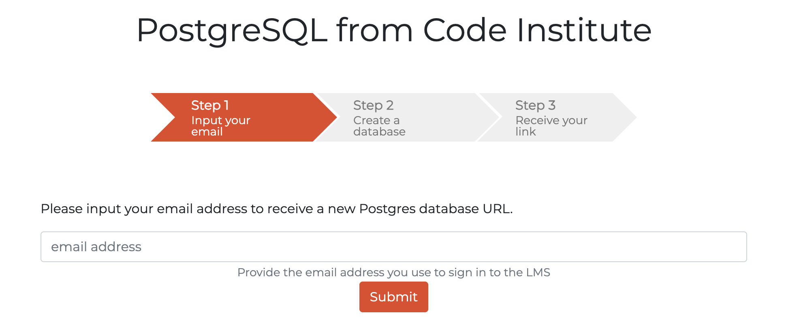
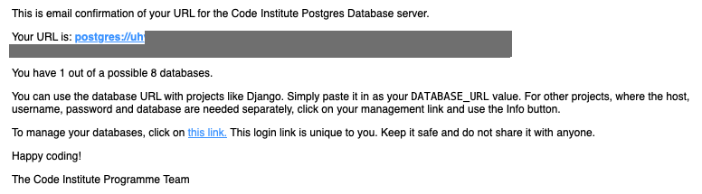
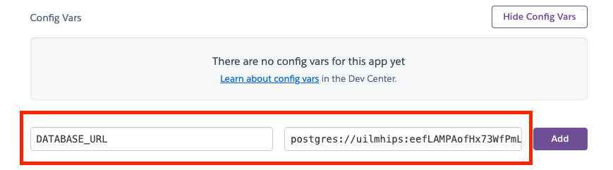

# Deployment and Payment setup

- The app was deployed to [Heroku](https://www.heroku.com/).
- The database was deployed to [CI PostgreSQL](https://dbs.ci-dbs.net/).

- The app can be reached by the [link](#).

---

## Payment Setup

### Step 1: Stripe Account Setup

1. **Create a Stripe Account:** Begin by registering a new account on Stripe's official website [here](https://dashboard.stripe.com/register).
2. **Retrieve API Keys:**
    - Navigate to the API section of the Stripe dashboard.
    - Securely store your `public key` and `secret key` in your `env.py` file.

### Step 2: Install Stripe Library
- **Install Stripe Python Library:**

```python
  pip3 install stripe
```

### Step 3: Configure Stripe in Django

- **Set Environment Variables:**
    - Add the following configurations in your Django `settings.py`:

    ```python
    STRIPE_PUBLIC_KEY = os.getenv("STRIPE_PUBLIC_KEY")
    STRIPE_SECRET_KEY = os.getenv("STRIPE_SECRET_KEY")
    ```

### Step 4: Implement Stripe Payment in Views

- **Create a Basket or Checkout view**:
    - Create a payment intent when the user proceeds to checkout:

    ```python
    import stripe
    from django.conf import settings

    stripe.api_key = settings.STRIPE_SECRET_KEY

    def basket_view(request):
        stripe.api_key = settings.STRIPE_SECRET_KEY
        total = calculate_total(request)
        intent = stripe.PaymentIntent.create(
            amount=total,
            currency='eur',
            metadata={'userid': request.user.id}
        )
        return render(request, 'payment/process_payment.html', {
            'client_secret': intent.client_secret,
            'STRIPE_PUBLIC_KEY': settings.STRIPE_PUBLIC_KEY,
        })
    ```

### Step 5: AJAX Handlers for Basket Operations

1. **Add Item to Basket:**
    - AJAX POST request to add an item to the basket:

    ```js
    $(document).on('click', '#add-button', function (e) {
        e.preventDefault();
        var url = $(this).data('url');
        $.ajax({
            type: 'POST',
            url: url,
            data: {
                productid: $(this).val(),
                productqty: $('#select option:selected').val(),
                csrfmiddlewaretoken: $('input[name="csrfmiddlewaretoken"]').val(),
                action: 'post'
            },
            success: function (json) {
                document.getElementById('basket-qty').innerHTML = json.qty;
                window.location.reload();
            }
        });
    });
    ```

3. **Update Item in Basket:**
    - AJAX POST request to update the quantity of an existing item:
    ```js
    $(document).on('click', '.update-button', function (e) {
        e.preventDefault();
        var prodid = $(this).data('index');
        var url = $(this).data('update-url');
        $.ajax({
        type: 'POST',
        url: url,
        data: {
            productid: $(this).data('index'),
            productqty: $('#select' + prodid + ' option:selected').val(),
            csrfmiddlewaretoken: $('input[name="csrfmiddlewaretoken"]').val(),
            action: 'post'
        },
        success: function (json) {
            document.getElementById("basket-qty").innerHTML = json.qty;
            document.getElementById("subtotal").innerHTML = json.subtotal;
            window.location.reload();
        }
        });
    });
    ```

### Step 6: Finalizing the Payment Form

- **Embed Stripe Elements in the Payment Form**:
    - Initialize Stripe Elements and mount the card element in the payment form:

    ```js
    var stripe = Stripe('{{STRIPE_PUBLIC_KEY}}');
    var elements = stripe.elements();
    var card = elements.create('card', {style: style});
    card.mount('#card-element');

    card.on('change', function(event) {
        var displayError = document.getElementById('card-errors');
        if (event.error) {
            displayError.textContent = event.error.message;
        } else {
            displayError.textContent = '';
        }
    });
    ```

- **Form Submission Handling**:
    - Submit the payment form and handle the response:

    ```js
    var form = document.getElementById('payment-form');
    form.addEventListener('submit', function(event) {
        event.preventDefault();
        stripe.confirmCardPayment('{{client_secret}}', {
            payment_method: {
                card: card,
                billing_details: {
                    name: 'Jenny Rosen'
                }
            }
        }).then(function(result) {
            if (result.error) {
                // Show error to your customer
                showError(result.error.message);
            } else {
                // The payment has been processed!
                if (result.paymentIntent.status === 'succeeded') {
                    // Show a success message to your customer
                    showSuccess();
                }
            }
        });
    });
    ```

### Step 7: Stripe Webhook Setup

1. **Define the Webhook Endpoint in Django:**
    - Set up a URL path in your Django application that points to the webhook handling view. This is typically done in your urls.py file within the appropriate Django app. Here's how you can define this path:

    ```JS
    from django.urls import path
    from .views import stripe_webhook

    urlpatterns = [
        path('webhook/', stripe_webhook, name='stripe-webhook'),
    ]
    ```

2. **Implement the Webhook Handler:**
    - Set up a webhook endpoint in your Django application to listen for events from Stripe, particularly the `payment_intent.succeeded` event.

    ```JS
    @csrf_exempt
    def stripe_webhook(request):
        payload = request.body
        event = None

        try {
            event = stripe.Event.construct_from(
                json.loads(payload), stripe.api_key
            )
        } catch (ValueError as e) {
            return HttpResponse(status=400)
        }

        if (event.type == 'payment_intent.succeeded') {
            payment_confirmation(event.data.object['client_secret'])
            return HttpResponse(status=200)
        } else {
            return HttpResponse(status=400)
        }
    ```

3. **Register the Webhook in Stripe:**
    - Log in to your Stripe dashboard and navigate to the Webhooks section.
    - Click “Add endpoint” and provide the URL you set up in your Django app (`https://yourdomain.com/webhook/`).
    - Select the events you want to receive. For handling payments, you might want to listen to events like `payment_intent.succeeded`.

### Step 8: Order Confirmation

- **Confirm the Order:**
    - Update the order status upon successful payment and redirect the user.

    ```JS
    def order_placed(request):
    # Clear the basket and render the order placed view
    return render(request, 'order_placed.html')
    ```

## Local deployment

1. Clone the repository.

    - ```git clone https://github.com/DietkeSt/GraphicDesignShop.git```

2. Go to the ```artistic_edge``` directory.

    - ```cd artistic_edge```

3. Create a virtual environment.

    - ```python3 -m venv venv```

    - ```source venv/bin/activate```

4. Install all dependencies.

    - ```pip install -r requirements.txt```

5. Create a ```env.py``` file.

    - ```touch env.py```

6. Add the following lines to ```env.py```:

    - ```import os```
    - ```os.environ["SECRET_KEY"]``` = your secret key.
    - ```os.environ["DEBUG"]``` = "True" or "False" depending on whether you are in development or production.
    - ```os.environ["DEVELOPMENT"]``` = "True" or "False" depending on whether you are in development or production.
    - ```os.environ["ALLOWED_HOSTS"]``` = your domain name.
    - ```os.environ["DATABASE_URL"]``` = your database url.
    - ```os.environ["CLOUDINARY_CLOUD_NAME"]``` = your cloudinary cloud name.
    - ```os.environ["CLOUDINARY_API_KEY"]``` = your cloudinary api key.
    - ```os.environ["CLOUDINARY_API_SECRET"]``` = your cloudinary api secret.
    - ```os.environ["STRIPE_PUBLIC_KEY"]``` = your stripe public key.
    - ```os.environ["STRIPE_SECRET_KEY"]``` = your stripe secret key.
    - ```os.environ["STRIPE_ENDPOINT_SECRET"]``` = your stripe endpoint secret key.
    - ```os.environ["EMAIL_HOST_PASSWORD"]``` = your sendgrid email host password.
    - ```os.environ["MAILCHIMP_API_KEY"]``` = your mailchimp api key.

7. Create and migrate the database.

---

## Heroku Deployment

### Step 1: Create Database with CI PostgreSQL

1. Go to [PostgreSQL from Code Institute](https://dbs.ci-dbs.net/).

2. Enter student email into the email address field and click the **"Submit"** button.

    

3. Follow the steps to create the database, and you'll receive an email with the database URL. You will need the URL of your database to connect it to your Django project.

    

---

### Step 2: Create a new Heroku App

1. Create a Heroku account if you don't already have one.

2. Create a new app on Heroku.

    1. Go to the [Heroku dashboard](https://dashboard.heroku.com/apps).
    2. Click on the "New" button.
    3. Click on the "Create new app" button.
    4. Choose a name for your app.
    5. Choose a region.
    6. Click on the "Create app" button.

3. In your app go to the **"Resources"** tab.

    1. Add a Heroku Postgres database.

4. In your app go to the **"Settings"** tab where you add the config var `DATABASE_URL`, and for the value, copy in your database url from CI PostgreSQL.

    
    
    - We'll come back here later to add more config vars.

---

### Step 3: Connect your Database to your local development web server

1. Open your local repository terminal and install `dj_database_url and psycopg2`to connect to your external database.

    ```
    pip3 install dj_database_url==0.5.0 psycopg2
    ```

2. Update your requirements.txt file with the newly installed packages.

    ```
    pip freeze > requirements.txt
    ```

3. In your settings.py file, import `dj_database_url` underneath the import for os.

    ```
    import os
    import dj_database_url
    ```

4. Scroll to the `DATABASES` section and update it to the following code, so that the original connection to sqlite3 is commented out and we connect to the new database instead.

    ```
    # DATABASES = {
    #     'default': {
    #         'ENGINE': 'django.db.backends.sqlite3',
    #         'NAME': os.path.join(BASE_DIR, 'db.sqlite3'),
    #     }
    # }
            
    DATABASES = {
        'default': dj_database_url.parse('your-database-url-here')
    }
    ```

    - Save your Database URL in your env.py file:
       
       `os.environ["DATABASE_URL"] = your database url` 
       
    - And update the DATABASES to the following code:

        ```
        DATABASES = {
        'default': dj_database_url.parse(os.environ.get("DATABASE_URL")),
        }
        ```

5. Now type in these commands into your terminal to load your new database:

    - Migrate your database models: 
        ```
        python3 manage.py migrate
        ```
    - Create a superuser for your new database: 
        ```
        python3 manage.py createsuperuser
        ```

---

### Step 4: Setup your Cloudinary 

**To get Cloudinary cloud name, API key, and API secret:**

1. Go to the [Cloudinary website](https://cloudinary.com/).

2. Log in to your account or sign up if you don't have an account.

3. Go to the the Cloudinary Dashboard by clicking on **"Dashboard"** on the left.

4. At the top of the page, you will see your cloud name, API key, and API secret.

5. To reveal API secret, hover over the API key container and click on the button that looks like an eye.

6. Copy these values and paste them into your `env.py` file:

    - ```os.environ["CLOUDINARY_CLOUD_NAME"]``` = your cloudinary cloud name.
    - ```os.environ["CLOUDINARY_API_KEY"]``` = your cloudinary api key.
    - ```os.environ["CLOUDINARY_API_SECRET"]``` = your cloudinary api secret.


In your local repository:

1. Open the terminal and add the Cloudinary libraries to your project:

```
pip install cloudinary django-cloudinary-storage
```

2. Update the `settings.py`:
```
import cloudinary
import cloudinary.uploader
import cloudinary.api


# Cloudinary settings
cloudinary.config(
    cloud_name=os.environ.get("CLOUDINARY_CLOUD_NAME"),
    api_key=os.environ.get("CLOUDINARY_API_KEY"),
    api_secret=os.environ.get("CLOUDINARY_API_SECRET"),
)


# Tell Django to use Cloudinary for static files and media uploads
DEFAULT_FILE_STORAGE = 'cloudinary_storage.storage.MediaCloudinaryStorage'
```

3. Add cloudinary to `INSTALLED_APPS`:

```
'cloudinary_storage',
'cloudinary',
```
 __   

    1. ```ALLOWED_HOSTS``` = your heroku domain name.
    2. ```CLOUDINARY_CLOUD_NAME``` = the cloud name you used when creating your cloudinary account.
    3. ```CLOUDINARY_API_KEY``` = the api key you got when created your cloudinary account.
    4. ```CLOUDINARY_API_SECRET``` = the api secret you got when created your cloudinary account.
    5. ```DATABASE_URL``` = the url of your heroku postgres database.
    6. ```REDIS_URL``` = the url of your heroku redis database.
    7. ```SECRET_KEY``` = a secret key for your app.
    8. ```EMAIL_HOST_USER``` = the email address you going to use to send emails.
    9. ```EMAIL_HOST_PASSWORD``` = the password for the email address you are using.
    10. ```DEBUG``` = True during development, False during production.
    11. ```DISABLE_COLLECTSTATIC``` = 1 during development. Remove this when deploying to production.
    12. ```STRIPE_PUBLIC_KEY``` = the public key you got when created your stripe account.
    13. ```STRIPE_SECRET_KEY``` = the secret key you got when created your stripe account.
    14. ```STRIPE_WEBHOOK_SECRET``` = the secret key you got when created your stripe webhook.

5. In your app go to the "Deploy" tab.

    1. If it's already possible, connect your Heroku account to your GitHub account and then click on the "Deploy" button.
    2. If not, you need to copy the Heroku CLI command to connect your heroku app and your local repository.

        - ```heroku git:remote -a <your-heroku-app-name>```

6. Go to your local repository.

7. Login to your Heroku account in your terminal and connect your local repository to your heroku app.

    1. ```heroku login -i``` - Enter all your Heroku credentials it will ask for.
    2. Paste the command you copied from step 5 into your terminal.

8. Create Procfile.

    This project uses Daphne server for its ability to run asynchronous applications in order to implement tech support chats in the future, so in this case if you want to implement chat functionality as well, you have to add the following to Procfile:

    - ```release: python manage.py migrate``` - this command will apply all migrations every time you re-deploy the app.
    - ```web: daphne ecommerce_project.asgi:application --port $PORT --bind 0.0.0.0 -v2``` - this command will run the app.
    - ```worker: python manage.py runworker -v2 channel_layer``` - this command will run the worker for the channel layer to run the async tasks.

9. Create ```requirements.txt```. This can be done by running the following command:

    - ```pip freeze > requirements.txt```
    or
    - ```pipreqs requirements.txt``` - if you have pipreqs installed.

10. Add and commit all changes.

11. Push your changes to Heroku.

    - ```git push heroku master```
    or
    - ```git push heroku main```

12. Check your app's logs in heroku dashboard and ensure everything is working.

13. After the development is done, you can change the ```DEBUG``` config var to ```False``` and remove the ```DISABLE_COLLECTSTATIC``` config var from the config vars on heroku.

To get Cloudinary cloud name, API key, and API secret:

1. Go to the [Cloudinary website](https://cloudinary.com/).

2. Log in to your account or sign up if you don't have an account.

3. Go to the [Cloudinary dashboard](https://cloudinary.com/console/).

4. At the top of the page, you will see your cloud name, API key, and API secret.

5. To reveal API secret, hover over the API key container and click on the button that looks like an eye.

6. Copy these values and paste them into the config vars on Heroku and into your `env.py` file.

To get stripe public key, secret key, and webhook secret:

**Please go to the Payment Setup section in the readme file for more information.**

[Payment Setup](#payment-setup)

*If you find any difficulties with the installation, please, visit the following project's [GitHub repository](https://github.com/IuliiaKonovalova/school_app), where you can find the images of the installation process.*

---

### 

### Create a new app on Render

Link to the deployed application on Render: [Cool School](https://cool-school.onrender.com/)

1. Create a new Render account if you don't already have one here [Render](https://render.com/).

2. Create a new application on the following page here [New Render App](https://dashboard.render.com/), choose **Webserver**:

    - 

3. Select the GitHub option and connect the application to the repository you created.

    - 

4. Search for the repository you created and click "Connect."

    - 

    - 

5. Create name for the application

    - 

6. Select the region where you want to deploy the application.

    - 

7. Select branch to deploy.

    - 

8. Select environment.

    - 

9. Render build command: `./build.sh`

    - 

10. Render start command: `daphne <NAME OF YOUR APP>.asgi:application --port $PORT --bind 0.0.0.0 -v2` + You can delete `Procfile` from your repository.

    - 

11. Select Free plan.

    - 

12. Click on "Advanced" settings.

    - 

13. Add the following environment variables:

    | Key      | Value          |
    |-------------|-------------|
    | WEB_CONCURRENCY | 4 |
    | DATABASE_URL | ************* |
    | SECRET_KEY | ************* |
    | DEBUG | False |
    | EMAIL_HOST_USER | ************* |
    | EMAIL_HOST_PASSWORD | ************* |
    | DISABLE_COLLECTSTATIC | 1 |
    | CLOUDINARY_URL | ************* |
    | CLOUDINARY_CLOUD_NAME | ************* |
    | CLOUDINARY_API_KEY | ************* |
    | CLOUDINARY_API_SECRET | ************* |
    | STRIPE_CURRENCY | ************* |
    | STRIPE_PUBLIC_KEY | ************* |
    | STRIPE_SECRET_KEY | ************* |
    | STRIPE_ENDPOINT_SECRET | ************* |

    *DATABASE_URL value is takes from ElephantSQL dashboard, SECRET_KEY value is takes from your local env.py file, DEBUG value is set to False, EMAIL_HOST_USER and EMAIL_HOST_PASSWORD values are takes from your Gmail account. STRIPE_CURRENCY, STRIPE_PUBLIC_KEY, STRIPE_SECRET_KEY, STRIPE_ENDPOINT_SECRET values are takes from your Stripe account. CLOUDINARY_URL, CLOUDINARY_CLOUD_NAME, CLOUDINARY_API_KEY, CLOUDINARY_API_SECRET values are takes from your Cloudinary account.*


14. Open VS Code and create a new file called `build.sh` in the root directory of your project.

    - 

15. Copy the following code into the `build.sh` file:

    ```bash
      set -o errexit
      pip install -r requirements.txt
      python manage.py collectstatic --noinput
      python manage.py makemigrations && python manage.py migrate
    ```

    -*pip install -r requirements.txt installs the packages detailed in your requirements.txt file.*
    - *python manage.py collectstatic collects all static files to allow them to be served in the production environment.*
    - *The –noinput flag allows the command to run with no additional input from the deploying developer.*
    - *python manage.py makemigrations && python manage.py migrate are run to ensure all migrations are made to your production database.*

16. Save the file `build.sh`.

17. Go to `settings.py` file and add the following code to add Render.com to allowed hosts:

    ```python
        RENDER_EXTERNAL_HOSTNAME = os.environ.get('RENDER_EXTERNAL_HOSTNAME')
        if RENDER_EXTERNAL_HOSTNAME:
            ALLOWED_HOSTS.append(RENDER_EXTERNAL_HOSTNAME)
    ```

   *If you have heroku in your allowed hosts, delete it*

18. Save the file `settings.py`.

19. Go to `env.py` and change to DATEBASE_URL value to the one you got from ElephantSQL.

    ```python
        os.environ["DATABASE_URL"] = '*************'
    ```

20. Create a superuser for your database.

    ```bash
        python manage.py createsuperuser
    ```

21. Commit and push the changes to GitHub.

22. Go back to Render and click "Create Web Service."

    - 

23. Wait for the completion of the deployment.

24. Go to admin panel and change the settings for the admin by assigning a role of `Boss` to allow the full control of the website including role assignment.

---