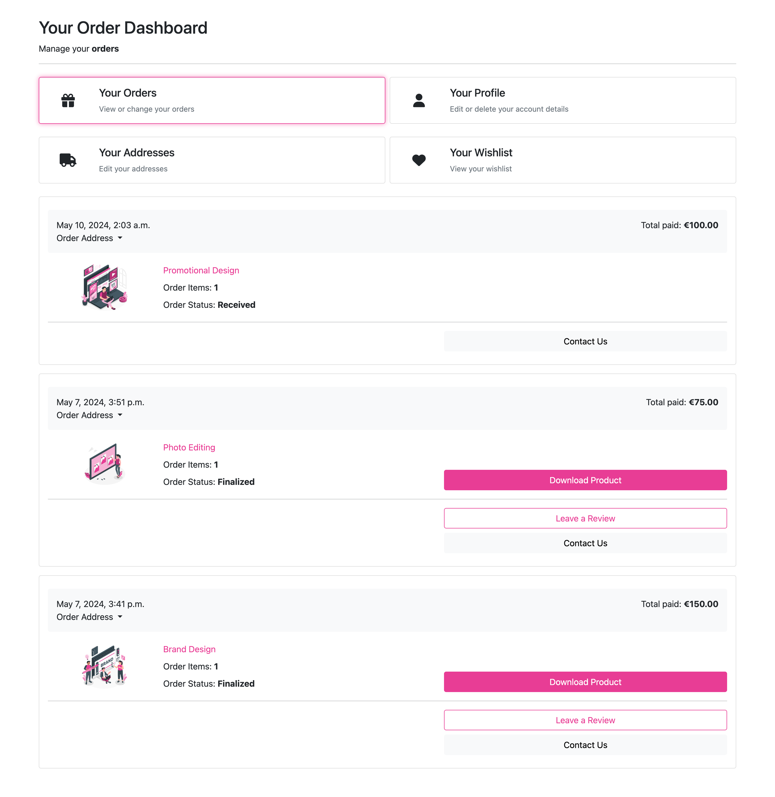
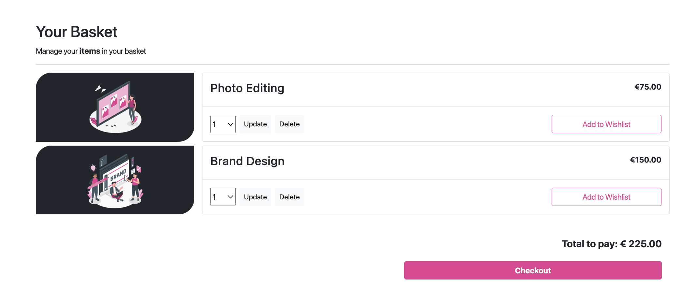
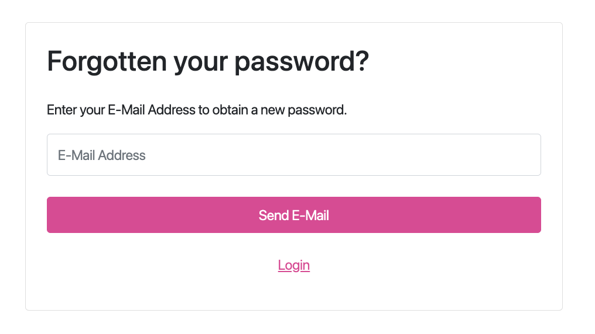

# Features

## Access to pages according to the user role:

| Page Name | Logged out  | Customers  | Admin   | 
| --------- | ----------- | ---------- | ------- | 
| Home       | Yes         | Yes        | Yes     | 
| Login      | Yes         | Yes        | Yes     |
| Register   | Yes         | Yes        | Yes     | 
| Logout     | No         | Yes        | Yes     |
| Store Services   | Yes         | Yes        | Yes     | 
| Store Service's Details | Yes         | Yes        | Yes     | 
| Star Rating   | Yes         | Yes        | Yes     |
| Basket       | Yes         | Yes        | Yes     | 
| Profile   | No         | Yes        | Yes     | 
| Edit profile   | No         | Yes        | Yes     | 
| Add address   | No         | Yes        | Yes     | 
| All addresses   | No         | Yes        | Yes     | 
| Edit address   | No         | Yes        | Yes     | 
| Orders   | No         | Yes        | Yes     | 
| Edit Profile   | No         | Yes        | Yes     | 
| Wishlist   | No         | Yes        | Yes     | 
| Leave Star Rating   | No         | Yes        | Yes     | 
| Checkout   | No         | Yes        | Yes     | 
| Categories | Yes         | Yes         | Yes     | 
| Add category | No         | No         | Yes     | 
| Edit category | No         | No         | Yes     | 
| Delete category | No         | No         | Yes     | 
| Products | Yes         | Yes         | Yes     |
| Add product | No         | No         | Yes     |
| Edit products | No         | No         | Yes     |
| Delete products | No         | No         | Yes     |
| Personnel Product's full details | No         | No         | Yes     |
| Add new image modal | No         | No         | Yes     | Yes   |
| Order's details | No         | No         | Yes     | 
| Edit order status feature | No         | No         | Yes     | 
| Edit Order | No         | No         | Yes     |
| Delete order | No         | No         | Yes     | 
| Edit order's item | No         | No         | Yes     | 
| Delete order's item | No         | No         | Yes     | 

## Main Features:

- Each page has a navbar and a footer

### Navbar:

The Navbar has two subsections:

1. Regular navbar, which is showing the main navigation:

        

    - The Navbar has the following features:

        - Logo, which redirects to the home page
        - Services, which opens dropdown with Service Categories
        - Portfolio, which redirects the user to the portfolio page
        - Contact, which redirects the user to the contact form
        - Admin (only visible for admins), which redirects the admin to the admin page
        - Basket, which redirects the user to the basket summary

2. Top banner, which is showing the login option and search bar:
      
    

    - The top banner has the following features:

        - Search bar, which allows users to search for services
        - Sign in or Register links when logged out
        - If the user is logged in:
            
            
            - Orders, which leads to order dashboard
            - Profile, which leads to profile dashboard
            - Wishlist, which leads to wishlist dashboard
            - Sign out, where the user can log out

The simplistic design of the Navbar is based on the decision to make the use of the web app easy for all users.

### Footer:

Footer has the following features:

- Services, with links to categories

- Portfolio, with links to Portfolio pages

- Contact & Privacy, with email and social contact options as well as privacy policy link

- Subscribe to newsletter form which allows anyone to subscribe

- Link to developer's github

- Social Links

### Home page:

The home page has:

- Hero section:

This section has an inviting text, eye-catching images and a button that links to the portfolio.

- Services section:

This section shows all available products and pricing as well as the average star rating of each service, giving the user a first impression of the offerings.

- Contact form section:

In this section the user can reach out if any questions come up which is a straighforward userfriendly experience.

### Profile page:

This page has the primary data on the customer for the logged-in user and allows user to edit this data.

It has three forms:

  - Edit account form;

    - Username can be changed

    - The user can upload or delete their profile image by clicking the "Choose File" button, and the user will be able to select an image from his computer. When the user selects an image, the form will be filled with the image's data.
        -  They can remove the image by ticking the "Remove" checkmark and Save the Changes.

  - Delete Account Form;
  
    - By hitting the delete button the user's account will be deleted.
    
  - Newsletter Form;
  
    - The subscription button appears dynamically as either subscribe or unsubscribe, depending on the user's subscription status.

### Addresses page:

This page empowers customers to store their addresses. And easily allows them to edit and delete them as well as set the default address.

It has a button: "Add Address," which redirects the user to the add address page.

It has a table of address cards:

Only one address can be default.

Each card has address data and two buttons.

  - Edit button, which redirects the user to the edit address page
  
  - Delete button, which allows the user to delete the address

  - Not default address cards also have an "Set to default" button, which allows the user to make the address default.

### Add/Edit address page:

The add and edit address pages utilize the same form. This page allows the user to add a new address by selecting the country, state, and city and typing the address, zip code, and phone number. The user can also edit an existing addresss.

It also has one button:

  - Update Address button, which updates an existing or saves a new address.

### Orders page:

This page has complete data on the Customer's orders and is presented by order cards.

Each card features the following data:

- Order date & time, as well as address
- Total amount paid
- Order item amount
- Item title
- Item images
- Order status
- Order Notes
- Contact Button
- Leave a Review Button
- Download Product Button

For each item, the user can find the service's name with the link to the service in-store. If the user clicks on the service's name, the user will be redirected to the product detail page.

**If an order is finalized, the Customer is allowed to add star ratings on the products**

Each item got the same button: "Leave a Review."

If the user clicks on the button, the star rating panel will open for the user and they can submit it for each item that has the finalized status.

The contact button will allow the customer to open the contact form on the same page to reach out.

And the Download product button allows the user to download the image for the finalized order.

### Category page:

This page has the following features:

  - Category title
  - Service cards for the category, with:
    - Service titles
    - Average star ratings
    - Pricing
    - Service image

- Back to all services link, which leads the customer back to the service section on the home page.
 
Users can click on each service card and will be redirected to the service detail page for that service.

### Service Detail page:

This page shows the service card with complete data.

It has the following features:

- Service Title
- Average Star rating
- Service description
- Costs
- Quanitity, the user can select the quantity before adding the service to the basket
- Two buttons:
    - Add to Basket, which allows the user to add the service to the basket
    - Add to Wishlist, which allows the user to add the service to the wishlist

Additionally, it display the main image of the Service on the left hand side. 

### Wishlist page:

This page has the following features:

  - Remove from wishlist button:
  
    - If the user removes the Service, it will be removed from the wishlist, and the user will see a message confirming the success of the operation.

    - If there are no items on the wishlist, the user will see a message: "No products have been added to your wishlist yet"

### Portfolio page:

This page shows all Portfolio items available displayed as cards. They feature the following:

- Portfolio Item title
- An excerpt of the description
- And each card has a "View Details" button, and upon clicking it the user will be redirected to the Portfolio Detail page. 

### Portfolio Detail page:

This page shows a detailed view of the Portfolio item, and includes:

- The portfolio title
- A big image representing a portfolio (Due to time constraint there are currently illustrations displayed instead of actual Designs)
- The Portfolio descripton

Then underneath there are features listed that are the same for each Portfolio item to enhance the positive aspects of working with ArtisticEdge:

    - Quick Turnaround
    - Customer Satisfaction

These cards should encourage the user to book a service with us, that's why there is a "Related Services" link underneath that leads to the Service cards displayed. The service cards are related to the same category and upon clicking on them the user is redirected to the Service Detail page.

### Basket page:

This page has the following features:

  - A list of Services in the basket:
  
    - With service image, title and price
    - A quantity selection option
    - Three buttons:
        - Update, to be able to update the quanitity before checkout
        - Delete, tot remove services from the basket
        - Add to Wishlist, to add a service to a wishlist if the user decides not to buy right away
    - The total amount to pay
    - The checkout button, which leads to the payment checkout page upon click

    If the user deletes, updates, or adds an item to the wishlist they will see a notification message according to their action.

      **Note!** When a user updates the item quantity in the basket, the total price for the item and the total spending will also be updated.

### Payment page:

This page has the following features:

  - Checkout form:

    - Which features the Select and existing address option, upon clicking on it, the user can choose a saved address which would be then auto-populated into the form.

    - This form is editable, and the user can change the data.

    - The email address is already taken from the user's account information and automatically filled.

  - Under the form, the user will see a payment card field with a "Pay for Order" button. Upon click on this button the order will be completed, or the user will see an error.
  
  - Next to the Checkout form is also a basket summary preview, which enables the user to click on "Edit Basket" if they want to change anything before payment. The user would then be redirected back to the basket summary page.

    *If there are any errors in the form, the user will see the messages*

Upon clicking on the Pay for Order button the user is redirected to an order placed page, that is confirming the order has been placed. They can then click back into their order dashboard.

### 404 and 500 pages:

It handles two types of errors:

- 404 error;
- 500 error;

Example of 404 error:

### Logout Page:

### Registration Page:

### Login Page:

### Forgot Password Page:

### Reset Password Page:

### Change Password Page Success:

