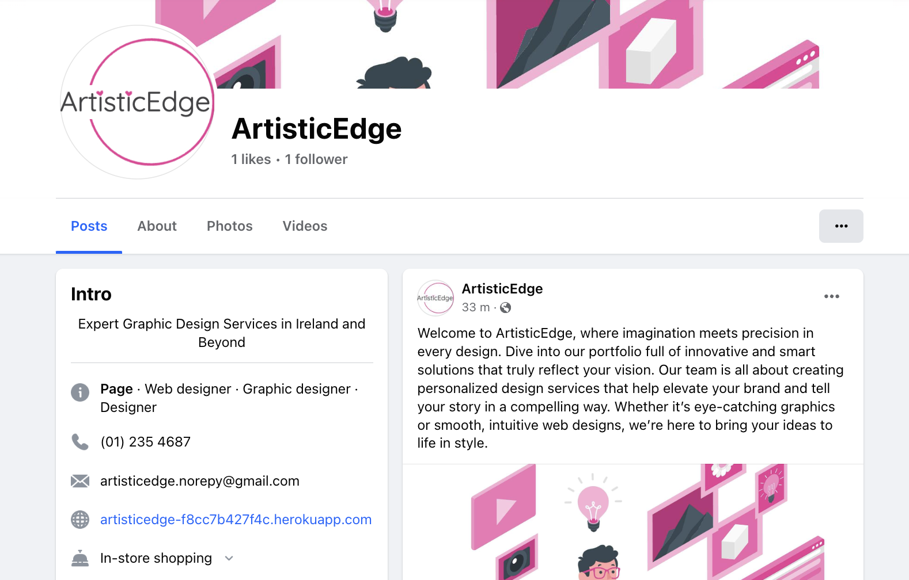

# ArtisticEdge - Graphic Design E-Commerce Website

**Deployed website: [Link to website](https://artisticedge-f8cc7b427f4c.herokuapp.com/)**

**Repository: [GitHub Repo](https://github.com/DietkeSt/GraphicDesignShop)**

**The app was developed by: [Dietke Steindel](https://github.com/DietkeSt)**


**Card number for payment testing: 4242424242424242**
## About
ArtisticEdge is more than just a graphic design service; it's a dynamic digital platform crafted specifically for creativity and client interaction. At ArtisticEdge, we merge imagination with precision to deliver custom design solutions that not only meet but exceed our clients' expectations. Whether you're browsing for inspiration or ready to commit to a project, our website is designed to support your journey from concept to completion.

### Mission
We are dedicated to transforming your ideas into visual realities. With a focus on customer satisfaction and efficient service, ArtisticEdge aims to provide an unmatched user experience. Our platform caters to a diverse range of design needs—from individual projects to comprehensive branding strategies. We ensure that every interaction is seamless, from the initial sign-up to the final delivery of your bespoke design.

---

## UX

ArtisticEdge is designed to be both eye-catching and user-friendly. Our platform offers an intuitive navigation system, allowing users to easily explore a variety of design services tailored to their needs. We emphasize simplicity and clarity in design, making the website straightforward to use and understand. By integrating a wishlist function, we also encourage them to return and engage further at a later stage. Behind the scenes, the website supports admin functionality, enabling staff members to efficiently manage the orders. This approach ensures that ArtisticEdge is scalable and adaptable, ready to meet real-world business demands effectively.

### Target Audience

The website caters to a diverse audience ranging from casual browsers seeking design inspiration to serious clients looking for bespoke graphic design services. Ideal for individuals or businesses contemplating unique, tailor-made designs for branding, web presence, or visual projects, the platform ensures an enriching experience for:

- **Design Enthusiasts and Browsers**: Users who explore design websites for creative ideas and latest trends without the immediate need to commit to a purchase. They benefit from easy navigation and the ability to follow updates via social media or newsletters.
- **Potential Clients**: Individuals or businesses with specific design projects in mind. These users appreciate a straightforward and secure sign-up process, clear service descriptions, and a user-friendly interface that simplifies the process of finding and purchasing the right services.
- **Returning Customers and Design Partners**: Those looking to establish a long-term relationship with a reliable designer, interested in customizable services and detailed project engagements. Our platform supports these interactions with features like bookmarking favorite designs, a wishlist, and seamless purchase transitions.
- **Freelancers and Business Users**: Particularly beneficial for freelancers who own their stores or business users responsible for managing design needs in their organizations. Our site provides tools for easy management of purchases, communication, and service adjustments.

### User Stories

#### Persona 1: Casual Website Visitor

| Issue ID    | User Story |
|-------------|-------------|
| [#1](https://github.com/DietkeSt/GraphicDesignShop/issues/1) | As a visitor I want to easily navigate the website, view the designer's portfolio, and get a feel for their style without signing up, allowing me to enjoy the content effortlessly. |
| [#2](https://github.com/DietkeSt/GraphicDesignShop/issues/2) | As a visitor I wish to have the option to subscribe to a newsletter or follow the designer on social media to stay updated on new designs and trends without committing to creating an account. |
| [#3](https://github.com/DietkeSt/GraphicDesignShop/issues/3) | I want to browse and search for graphic designs based on categories (icon, logo, poster). |
| [#4](https://github.com/DietkeSt/GraphicDesignShop/issues/4) | I want the option to easily inquire about a design service without committing to a purchase, allowing me to seek more information or discuss customization options with the designer. |
| [#5](https://github.com/DietkeSt/GraphicDesignShop/issues/5) | I want the option to easily save my preferred design services to a 'cart', allowing me to quickly proceed with the purchase when I decide to sign up. |
| [#6](https://github.com/DietkeSt/GraphicDesignShop/issues/6) | I want the option to easily remove items from my cart or undo accidental additions, ensuring a stress-free experience even if I don't intend to make a purchase. |
| [#7](https://github.com/DietkeSt/GraphicDesignShop/issues/7) | I'd appreciate a clear indication that my cart is empty and a seamless way to exit the checkout process without being prompted to create an account. |


#### Persona 2: Customer and Potential Customers Persona

| Issue ID    | User Story |
|-------------|-------------|
| [#8](https://github.com/DietkeSt/GraphicDesignShop/issues/8) | I expect a clear and user-friendly interface that guides me through the available services, enabling me to easily find and purchase the design service that matches my requirements. |
| [#9](https://github.com/DietkeSt/GraphicDesignShop/issues/9) | I want to view details of a graphic design, including its price and description. |
| [#10](https://github.com/DietkeSt/GraphicDesignShop/issues/10) | I want to order a graphic design by filling out a form with my requirements. |
| [#11](https://github.com/DietkeSt/GraphicDesignShop/issues/11) | I want to see a preview of the quote before making a payment.|
| [#12](https://github.com/DietkeSt/GraphicDesignShop/issues/12) | I want a smooth and secure checkout process, allowing me to review the details of the selected service, customize options if available, and complete the purchase with various payment options. *Future development: to pay with various payment methods* |
| [#13](https://github.com/DietkeSt/GraphicDesignShop/issues/13) | I want to track the status of my orders (pending, completed).  |
| [#14](https://github.com/DietkeSt/GraphicDesignShop/issues/14) | I want to leave a testimonial and rating for the completed designs.  |
| [#15](https://github.com/DietkeSt/GraphicDesignShop/issues/15) | I expect to receive a confirmation email with detailed information about the purchased service, including estimated delivery times and any additional steps required from my end. |
| [#16](https://github.com/DietkeSt/GraphicDesignShop/issues/16) | I want a transparent and easy-to-follow checkout process, providing a summary of the selected service, allowing me to review and confirm my purchase before completing the transaction. |
| [#17](https://github.com/DietkeSt/GraphicDesignShop/issues/17) | I want to easily find the 'Sign Up' option, where I can create an account with minimal information, allowing me to save favourite designs and preferences for future reference. |
| [#18](https://github.com/DietkeSt/GraphicDesignShop/issues/18) | I'd appreciate a feature that allows me to bookmark or save specific designs or services, so I can seamlessly transition to purchasing when I'm ready. |
| [#19](https://github.com/DietkeSt/GraphicDesignShop/issues/19) | I'd appreciate a clear pathway to add a service to a 'wishlist' for future reference, even if I'm not immediately ready to make a purchase. |
| [#20](https://github.com/DietkeSt/GraphicDesignShop/issues/20) | I'd appreciate personalized recommendations based on my saved designs and preferences, enhancing my overall shopping experience and making it more tailored to my interests. *Future Development* |
| [#21](https://github.com/DietkeSt/GraphicDesignShop/issues/21) | I want a straightforward option to create an account during the checkout process, with the ability to save my information securely for future purchases, minimizing the need for redundant data entry. |
| [#22](https://github.com/DietkeSt/GraphicDesignShop/issues/22) | I'd appreciate a clear distinction between the steps required for checkout and optional account creation, ensuring a smooth experience for both one-time and returning customers. *Future Development: Guest Checkout*  |


#### Persona 3: Service Provider (Graphic Designer and Shop Owner)
| Issue ID    | User Story |
|-------------|-------------|
| [#23](https://github.com/DietkeSt/GraphicDesignShop/issues/23) | As a Designer, I want to add new graphic designs to the platform.|
| [#24](https://github.com/DietkeSt/GraphicDesignShop/issues/24) | I want to view and manage all orders. |
| [#25](https://github.com/DietkeSt/GraphicDesignShop/issues/25) | I want to upload completed work for customers to download. |
| [#26](https://github.com/DietkeSt/GraphicDesignShop/issues/26) | I want to view and manage user accounts and roles.   |
| [#27](https://github.com/DietkeSt/GraphicDesignShop/issues/27) | I want to easily keep track of order, and user communication. |
| [#28](https://github.com/DietkeSt/GraphicDesignShop/issues/28) | I wish to have the option to access billing information through user sign-ups for my bookkeeping and invoice creation. *Future Development: Invoice Creation* |
| [#29](https://github.com/DietkeSt/GraphicDesignShop/issues/29) | I want to receive timely notifications and details when a customer purchases one of my design services, allowing me to prepare for the project and meet the client's expectations. |
| [#30](https://github.com/DietkeSt/GraphicDesignShop/issues/30) | I wish to have a user-friendly dashboard that provides insights into sales performance, helping me understand which services are popular and allowing me to optimize my offerings. *Future Development: Analytics Dashboard* |
| [#31](https://github.com/DietkeSt/GraphicDesignShop/issues/31) | I want to provide customer support through accessible channels during the checkout process, such as a contact form, ensuring that customers can get assistance if they encounter any issues. |
| [#32](https://github.com/DietkeSt/GraphicDesignShop/issues/32) | I wish to receive real-time notifications for successful transactions and, if applicable, be notified of abandoned carts to follow up with potential customers and address any concerns they might have. *Future Development: Abandoned Carts Notification* |


## Business Model

### Overview
ArtisticEdge operates on a Business-to-Consumer (B2C) and Business-to-Business (B2B) model, specifically tailored for individuals and companies seeking professional graphic design services. Our platform enables customers to explore and purchase customized design solutions directly from a graphic designer.

### Target Audience

#### Persona 1: Casual Website Visitor
- **Interest:** Exploring graphic design websites for inspiration and trends.
- **Behavior:** Prefers to navigate freely without mandatory sign-ups, appreciates easy access to design portfolios and updates.

#### Persona 2: Customer Persona
- **Interest:** Specific project in mind, considering hiring a graphic designer.
- **Behavior:** Seeks a secure, straightforward sign-up process to facilitate future transactions, values clear and efficient service exploration.

#### Persona 3: Potential Customer
- **Interest:** Impressed by the portfolio, considers future engagement.
saving- **Behavior:** Desires an easy sign-up for future purchases, prefers saving favorite designs in a wishlist.

#### Persona 4: Service Provider (Graphic Designer and Shop Owner)
- **Interest:** Attracting and managing customers, overseeing order fulfillment.
- **Behavior:** Needs efficient tracking and management tools for user interactions and purchases.

### Marketing Strategies

#### Digital Presence and SEO
- **SEO Implementations:** Utilizing META descriptions and targeted keywords such as "ArtisticEdge, graphic design Ireland, web design services" to improve search engine visibility and attract both local and global clients.
- **Social Media Integration:** Encouraging visitors to follow on social platforms and subscribe to newsletters for continuous engagement and updates.

#### User Experience Design
- **Website Navigation:** Streamlined user interface designed for ease of use, helping visitors explore services without hassles.
- **Personalization:** Features like wishlists, reviews, and service suggestions to enhance user engagement and satisfaction.

#### Sales and Customer Retention
- **Service Diversity:** Offering a range of services from logo design to complete branding solutions to cater to diverse customer needs.
- **Customer Support:** Providing support before purchase, and after purchase to ensure customer satisfaction and loyalty.

### Transaction Model

#### Sign-Up Process
- Simplified sign-up during checkout to encourage conversion, with optional account creation to save preferences and expedite future purchases.

#### Checkout Experience
- Transparent and secure checkout process. Real-time notifications for the store owner to manage orders effectively.

### Performance Metrics
- Utilization of service popularity via reviews to continuously refine and optimize service offerings.

## Conclusion

ArtisticEdge is committed to delivering exceptional graphic design services that meet the dynamic needs of a diverse client base. Through strategic SEO, user-centric design, and personalized customer interaction, we aim to build long-lasting relationships and a reputable brand in the graphic design industry.

---

## Web Marketing

**1. Newsletter**

The newsletter was implemented by using [Mailchimp](https://mailchimp.com/). The admin can create a newsletter via the Mailchimp account and send it to all subscribed users.

- Visitor can subscribe via the footer of the website and will be redirected to a Thank You page on the website without having to register.

  
  

- Signed in users can subscribe after being logged in directly in their user profile.
- Signed in users can also unsubscribe directly in their user profile.

  


The newsletter subscription for the account was implemented in the newsletter app which checks the user's current subscription status.

---


**2. Facebook - [Link to Page](https://www.facebook.com/people/ArtisticEdge/61559018086019/)**

Facebook is essential to be able to reach customers. According to the statistics, the store has a good reach among people who prefer to use Facebook. Facebook has excellent coverage worldwide among people who can purchase products online.

"ArtisticEdge" Facebook page is for marketing purposes to post adverts and exciting content and engage users.



---


**3. LinkedIn - [Link to Page](https://www.linkedin.com/company/artisticedgedesign/)**

"ArtisticEdge" LinkedIn page is useful to reach businesses in need of Web and Graphic Design Services. It is used for marketing purposes, pro-active outreach and afvert post, exciting content and to start discussions in the Design industry.


**Note:** *`rel="noopener noreferrer"` was used for all social links opening in a new tab*.

### SEO implementations in HTML

- META descriptions for search engines:

  - *Explore ArtisticEdge, your global partner for exceptional graphic design services. Specializing in web design, branding, and visual graphics, we elevate your brand with custom, high-quality design solutions tailored to your unique needs.* 

  The description was written to be engaging and informative, summarizing the core services ("web design, branding, visual graphics") and unique value proposition ("custom, high-quality design solutions tailored to your unique needs"). This clarity enhances click-through rates from search engine results pages by appealing directly to potential clients looking for custom design services.

- Keywords:

  - *ArtisticEdge, graphic design Ireland, web design services, custom branding services, graphic design studio, visual graphics, logo design, user interface design, digital art, promotional graphics, Ireland design services, global design services*

  The keywords include specific services and geographical tags such as "graphic design Ireland" and "global design services" to target both local and international markets. Keywords like "web design services", "custom branding services", and "logo design" are directly related to the business's offerings, increasing the relevance of the page for those particular search queries.

- Title: 

  - *ArtisticEdge | Expert Graphic Design Services | Ireland and Worldwide*

  The title was chosen to effectively communicate the brand name and main service offering while emphasizing geographical scope. This helps in attracting both local and global audiences.

### Other SEO implementations

1. Implemented a sitemap.xml into the root directory for the project. 

  - Used https://www.xml-sitemaps.com/ to create the sitemap.xml
  - The sitemap can then be registered in the [Google Search Console](https://search.google.com/search-console/welcome).

2. Implemented a robots.txt into the root directory for the project.

  - The robots.txt file can be tested directly on Google [here](https://support.google.com/webmasters/answer/6062598).

**Note:** *As this is not a requirement for this project, the sitemap was not registered and robots.txt was not tested.*


---

## Future Development

#### Support Chat

Chat support is planned to be implemented to provide the customers with the best possible service.

#### Payment system

I want to implement PayPal payment system in the future as many customers prefer it. I am also considering adding more payment functionality into the Stripe payment system already implemented, so the user can choose their preferred method.

#### Order cancellation

At the moment, the customer would need to manually reach out to cancel an order. As this would require a payment refund, this feature requires more research time to implement, which is why it is not implemented at this stage.

#### Improved Email Design

The notification emails sent out at the moment are plain text and in some cases not formatted. This is due to time constraints during this project and as a developer I made the decision to improve on the emails at a later stage as it is not a crucial feature for the website functionality.

#### Personalized Recommendations

The personalized recommendations should be based on items on the wishlist and previous purchases. This needs some more research time to implement.

#### Guest Checkout

This was not implemented yet due to time constraints, but is planned for future development.

#### Invoice Creation

At the moment, the store owner is able to see the billing details in the account, so would be able to manually create invoice. An automatic invoice creation option would require more research time.

#### Analytics Dashboard

It would be great to see a detailed analytics dashboard that provides insights in sales performance. This should help in understanding which services are popular and see when customers abandoned a cart.

#### Abandoned Cart Notifications

In addition to the dashboard a simple abandoned cart notification is planned for future development, allowing the store owner to follow up with the customer or potential customer.


---


## Technologies used
- ### Languages:
    
    + [Python 3.8.5](https://www.python.org/downloads/release/python-385/): the primary language used to develop the server-side of the website.
    + [JS](https://www.javascript.com/): the primary language used to develop interactive components of the website.
    + [HTML](https://developer.mozilla.org/en-US/docs/Web/HTML): the markup language used to create the website.
    + [CSS](https://developer.mozilla.org/en-US/docs/Web/css): the styling language used to style the website.

- ### Frameworks and libraries:

    + [Django](https://www.djangoproject.com/): python framework used to create all the logic.
    + [jQuery](https://jquery.com/): was used to control click events and sending AJAX requests.
    + [jQuery User Interface](https://jqueryui.com/) was used to create interactive elements.

- ### Databases:

    + [SQLite](https://www.sqlite.org/): was used as a development database.
    + [Code Institute's PostgreSQL](https://dbs.ci-dbs.net/): the database used to store all the data.


- ### Other tools:

    + [Git](https://git-scm.com/): the version control system used to manage the code.
    + [Pip3](https://pypi.org/project/pip/): the package manager used to install the dependencies.
    + [Gunicorn](https://gunicorn.org/): the web server used to run the website.
    + [Psycopg2](https://www.psycopg.org/): the database driver used to connect to the database.
    + [Django-allauth](https://django-allauth.readthedocs.io/en/latest/): the authentication library used to create the user accounts.
    + [Django-crispy-forms](https://django-cryptography.readthedocs.io/en/latest/): was used to control the rendering behavior of Django forms.
    + [Render](https://pypi.org/project/render/): was used to render the README file.
    + [GitHub](https://github.com/): used to host the website's source code.
    + [VSCode](https://code.visualstudio.com/): the IDE used to develop the website.
    + [GitPod](https://www.gitpod.io/): the IDE was additionally used to develop the website.
    + [Chrome DevTools](https://developer.chrome.com/docs/devtools/open/): was used to debug the website.
    + [Font Awesome](https://fontawesome.com/): was used to create the icons used in the website.
    + [Draw.io](https://www.lucidchart.com/) was used to make a flowchart for the README file.
    + [Coolors](https://coolors.co/202a3c-1c2431-181f2a-0b1523-65e2d9-925cef-6b28e0-ffffff-eeeeee) was used to make a color palette for the website.
    + [W3C Validator](https://validator.w3.org/): was used to validate HTML5 code for the website.
    + [W3C CSS validator](https://jigsaw.w3.org/css-validator/): was used to validate CSS code for the website.
    + [JShint](https://jshint.com/): was used to validate JS code for the website.
    + [PEP8](https://pep8.org/): was used to validate Python code for the website.
    + [stripe](https://stripe.com/): was used to create the payment system.
    + [Sitemap Generator](https://www.xml-sitemaps.com/) was used to create the sitemap.xml file.
    + [Privacy Policy Generator](https://www.privacypolicygenerator.info/) was used to create the privacy policy.

---

## Features


Please refer to the [FEATURES.md](FEATURES.md) file for all test-related documentation.


---
## Design

The design of the website embraces the robust and intentional aesthetic of [Material Design principles](https://www.creative-tim.com/blog/web-design/12-absolute-principles-material-design/). In aligning with these guidelines, a minimalistic color palette has been selected that enhances usability while adhering to Material Design standards. The design approach is minimalistic, prioritizing clarity and utility, ensuring that every element serves a purpose without distracting from the user's core objectives.

This multifunctional application is designed to enrich the customer experience and streamline business management processes. It incorporates numerous components, each crafted to operate cohesively within a larger system. The strategic use of white space throughout the application's interface plays a pivotal role in this design, fostering a calming and pleasant user environment. This thoughtful spacing allows users, whether they are customers or staff members, to focus more effectively on the essential content and tasks at hand.

By emphasizing simplicity and functionality, the application not only meets the demands of modern business operations but also delivers a delightful and intuitive user experience.

### Color Scheme

The application's color scheme is based on the combination of bold and neutral colors. The bold colors are used to create a more vibrant and attractive user experience and get the attention of the user. The neutral colors are used to create a more calm and relaxed user experience that goes along with the highlight color.

  

- Pink (`#E83D95`) - This is the primary color used extensively throughout the site for focus states, buttons, links, and other interactive elements. It is the brand color and is used to draw attention to important features and controls.
- Lighter Pink (`#E56D90`) - This color appears in hover states for links and buttons, providing a subtle visual cue of interactivity. It is used to maintain a cohesive aesthetic while differentiating user interactions.
- Black (`#000000`) - Used as a background color in various places such as the top banner and footer, providing a strong contrast against the pink tones.
- White (`#FFFFFF`) - Commonly used for text and background in dropdown menus and other elements, providing contrast against the darker tones of the top banner and footer, and enhancing readability.
- Gold (`#FFD700`) - This color is used for star ratings, adding a classic color often associated with quality and value, which helps to visually signify rating levels in a traditional, easily understandable way.

The color scheme for the text is quite simple to create a more readable user experience. It is using the bootsrap attributes to either use dark or light text.

Accent colors are implemented with the pink primary color `#E83D95` to help users navigate the application. The accent colors are used to create a more vibrant and attractive user experience.

  

### Typography

ArtisticEdge employs system fonts for its typography, providing a familiar and efficient user experience. This approach ensures optimal readability and quick loading times, as it uses the default fonts already installed on users' devices. The use of system fonts not only enhances performance but also maintains a consistent look across various platforms, aligning seamlessly with the intuitive and user-friendly design of the website.

### Imagery

- The website uses the same style of illustration images throughout for a cohesive user experience. The images use the primary color as the focus color.

- Images were downloaded from the websites listed in the **Credits section**. [Content and Images](#content-and-images)

- The main part is allocated to using icons from the [font awesome](https://fontawesome.com/) website. Icons are essential for the user experience when it comes to multifunctional websites.

### Wireframes

------>   [ArtisticEdge Wireframes](documentation/design/wowder_wireframes.pdf)

---

## Agile Methodology

### GitHub Project Management

GitHub Project Management was used to manage the project. If it hadn't been for the GitHub project management, I wouldn't have been able to manage the development of the application. It helped me to prioritize the tasks and to keep track of my progress.


---

## Flowcharts

To understand some concepts, I created several flowchart diagrams.

1. Sending stock email notifications to users who have left a request for a particular product inventory.

[Flowchart](documentation/flowcharts/stock_email_notifications_flowchart.pdf)

2. Get discount after applying the coupon code for loyalty program.

[Flowchart](documentation/flowcharts/get_promo_price_flowchart.pdf)

3. Payment system.

[Flowchart](documentation/flowcharts/payment_flowchart.pdf)

---

## Information Architecture

### Database

* During the earliest stages of the project, the database was created using SQLite.
* The database was then migrated to PostgreSQL.

### Entity-Relationship Diagram


### Data Modeling

#### Role Model
| Name          | Database Key  | Field Type    | Validation |
| ------------- | ------------- | ------------- | ---------- |
| name          | name          | CharField    | max_length=50, unique=True, blank=True, null=False, verbose_name='Role name' |
| description   | description   | TextField    | max_length=500, blank=True, null=True, verbose_name='Role description' |


#### Profile Model

When user signs up, a new profile is created. 

| Name          | Database Key  | Field Type    | Validation |
| ------------- | ------------- | ------------- | ---------- |
| user          | user          | OneToOneField | User, on_delete=models.CASCADE, related_name='profile', verbose_name='User' |
| first_name    | first_name    | CharField    | max_length=50, blank=True, null=True, verbose_name='First name' |
| last_name     | last_name     | CharField    | max_length=50, blank=True, null=True, verbose_name='Last name' |
| birthday      | birthday      | DateField    | blank=True, null=True, verbose_name='Birthday' |
| avatar        | avatar        | CloudinaryField | blank=True, null=True, verbose_name='Avatar' |
| subscription | subscription | BooleanField | default=False, verbose_name='Subscription' |
| role          | role          | ForeignKey   | Role, default=1, on_delete=models.SET_NULL, null=True, verbose_name='Role' |
| created_at    | created_at    | DateTimeField | auto_now_add=True, verbose_name='Created at' |
| updated_at    | updated_at    | DateTimeField | auto_now=True, verbose_name='Updated at' |

**Note:** The role field is set to 1 by default. This is because the user is a customer by default. The role can be changed only from the admin panel. The decision to make it mandatory was made due to the store security reasons. **Only the site admin can change the role of the user in order to prevent unauthorized access.**

#### Address Model

Users are encouraged to create their own addresses and set the default address for the fastest purchase. 

| Name          | Database Key  | Field Type    | Validation |
| ------------- | ------------- | ------------- | ---------- |
| user          | user          | ForeignKey   | User, on_delete=models.CASCADE, related_name='addresses', verbose_name='User' |
| country       | country       | CharField    | max_length=50, blank=False, null=False, verbose_name='Country' |
| county_region | county_region | CharField    | max_length=50, blank=False, null=False, verbose_name='County/region' |
| city          | city          | CharField    | max_length=50, blank=False, null=False, verbose_name='City' |
| address_line  | address_line  | CharField    | max_length=150, blank=False, null=False, verbose_name='Address line' |
| zip_code      | zip_code      | CharField    | max_length=10, blank=False, null=False, verbose_name='Zip code' |
| phone_number  | phone_number  | CharField    | max_length=15, blank=False, null=False, verbose_name='Phone' |
| is_primary    | is_primary    | BooleanField | default=False, verbose_name='Is primary' |
| created_at    | created_at    | DateTimeField | auto_now_add=True, verbose_name='Created at' |
| updated_at    | updated_at    | DateTimeField | auto_now=True, verbose_name='Updated at' |

#### Wishlist Model

When the user signs up, a new wishlist is created.

| Name          | Database Key  | Field Type    | Validation |
| ------------- | ------------- | ------------- | ---------- |
| user          | user          | ForeignKey   | User, on_delete=models.CASCADE, related_name='wishlist', verbose_name='User' |
| products      | products      | ManyToManyField | Product, blank=True, related_name='wishlist', verbose_name='Products' |
| created_at    | created_at    | DateTimeField | auto_now_add=True, verbose_name='Created at' |

#### Category Model

| Name          | Database Key  | Field Type    | Validation |
| ------------- | ------------- | ------------- | ---------- |
| name          | name          | CharField    | max_length=100, unique=True, blank=False, null=False, verbose_name='Category name' |
| slug          | slug          | SlugField    | max_length=150, unique=True, blank=False, null=False, verbose_name='Category Slug' |
| is_active     | is_active     | BooleanField | default=False, verbose_name='Is active' |
| created_at    | created_at    | DateTimeField | auto_now_add=True, verbose_name='Created at' |
| updated_at    | updated_at    | DateTimeField | auto_now=True, verbose_name='Updated at' |

#### Tag Model

| Name          | Database Key  | Field Type    | Validation |
| ------------- | ------------- | ------------- | ---------- |
| name          | name          | CharField    | max_length=100, unique=True, blank=False, null=False, verbose_name='Tag name' |
| slug          | slug          | SlugField    | max_length=150, unique=True, blank=False, null=False, verbose_name='Tag Slug' |
| is_active     | is_active     | BooleanField | default=False, verbose_name='Is active' |
| created_at    | created_at    | DateTimeField | auto_now_add=True, verbose_name='Created at' |
| updated_at    | updated_at    | DateTimeField | auto_now=True, verbose_name='Updated at' |

#### Brand Model

| Name          | Database Key  | Field Type    | Validation |
| ------------- | ------------- | ------------- | ---------- |
| name          | name          | CharField    | max_length=100, unique=True, blank=False, null=False, verbose_name='Brand name' |
| slug          | slug          | SlugField    | max_length=150, unique=True, blank=False, null=False, verbose_name='Brand Slug' |
| description   | description   | TextField    | max_length=500, blank=False, null=False, verbose_name='Brand description' |
| is_active     | is_active     | BooleanField | default=False, verbose_name='Is active' |
| created_at    | created_at    | DateTimeField | auto_now_add=True, verbose_name='Created at' |
| updated_at    | updated_at    | DateTimeField | auto_now=True, verbose_name='Updated at' |


#### Product Model

| Name          | Database Key  | Field Type    | Validation |
| ------------- | ------------- | ------------- | ---------- |
| name          | name          | CharField    | max_length=100, unique=True, blank=False, null=False, verbose_name='Product name' |
| slug          | slug          | SlugField    | max_length=150, unique=True, blank=False, null=False, verbose_name='Product Slug' |
| description   | description   | TextField    | max_length=500, blank=False, null=False, verbose_name='Product description' |
| category      | category      | ForeignKey   | Category, on_delete=models.CASCADE, related_name='products', verbose_name='Category' |
| tags          | tags          | ManyToManyField | Tag, related_name='products', verbose_name='Tags' |
| brand         | brand         | ForeignKey   | Brand, on_delete=models.CASCADE, related_name='products', verbose_name='Brand' |
| is_active     | is_active     | BooleanField | default=False, verbose_name='Is active' |
| created_at    | created_at    | DateTimeField | auto_now_add=True, verbose_name='Created at' |
| updated_at    | updated_at    | DateTimeField | auto_now=True, verbose_name='Updated at' |

#### ProductImage Model

| Name          | Database Key  | Field Type    | Validation |
| ------------- | ------------- | ------------- | ---------- |
| product       | product       | ForeignKey   | Product, on_delete=models.CASCADE, related_name='images', verbose_name='Product' |
| image         | image         | CloudinaryField | null=True, blank=True, verbose_name='Image' |
| alt_text      | alt_text      | CharField    | max_length=300, null=True, blank=True, verbose_name='Alt text' |
| default_image | default_image | BooleanField | default=False, verbose_name='Default image' |
| is_active     | is_active     | BooleanField | default=False, verbose_name='Is active' |
| created_at    | created_at    | DateTimeField | auto_now_add=True, verbose_name='Created at' |
| updated_at    | updated_at    | DateTimeField | auto_now=True, verbose_name='Updated at' |

#### ProductAttribute Model

| Name          | Database Key  | Field Type    | Validation |
| ------------- | ------------- | ------------- | ---------- |
| name          | name          | CharField    | max_length=255, unique=True, blank=False, null=False, verbose_name='Attribute name' |
| description   | description   | TextField    | max_length=500, blank=True, null=True, verbose_name='Attribute description' |

#### ProductType Model

| Name          | Database Key  | Field Type    | Validation |
| ------------- | ------------- | ------------- | ---------- |
| name          | name          | CharField    | max_length=100, unique=True, blank=False, null=False, verbose_name='Product type name' |
| slug          | slug          | SlugField    | max_length=150, unique=True, blank=False, null=False, verbose_name='Product type Slug' |
| product_type_attributes | product_type_attributes | ManyToManyField | ProductAttribute, related_name="product_type_attributes", through="ProductTypeAttribute", verbose_name='Product type attributes' |
| description   | description   | TextField    | max_length=500, blank=False, null=False, verbose_name='Product type description' |

#### ProductAttributeValue Model

| Name          | Database Key  | Field Type    | Validation |
| ------------- | ------------- | ------------- | ---------- |
| product_attribute | product_attribute | ForeignKey   | ProductAttribute, on_delete=models.CASCADE, related_name='product_attribute_values', verbose_name='Product attribute' |
| attribute_value | attribute_value | CharField    | max_length=255, blank=False, null=False, verbose_name='Attribute value' |

#### ProductInventory Model

| Name          | Database Key  | Field Type    | Validation |
| ------------- | ------------- | ------------- | ---------- |
| sku           | sku           | CharField    | max_length=50, null=False, unique=True, blank=False, verbose_name='Stock Keeping Unit' |
| upc           | upc           | CharField    | max_length=12, null=False, unique=True, blank=False, verbose_name='Universal Product Code' |
| product       | product       | ForeignKey   | Product, on_delete=models.CASCADE, related_name='inventory', verbose_name='Product' |
| product_type  | product_type  | ForeignKey   | ProductType, on_delete=models.CASCADE, related_name='inventory', verbose_name='Product type' |
| attribute_values | attribute_values | ManyToManyField | ProductAttributeValue, related_name="product_attribute_values", through="ProductAttributeValues", verbose_name='Attribute values' |
| retail_price  | retail_price  | DecimalField | max_digits=9, decimal_places=2, null=False, blank=False, verbose_name='Retail price' |
| store_price   | store_price   | DecimalField | max_digits=9, decimal_places=2, null=False, blank=False, verbose_name='Store price' |
| sale_price    | sale_price    | DecimalField | max_digits=9, decimal_places=2, null=False, blank=False, verbose_name='Sale price' |
| weight        | weight        | FloatField   | null=False, blank=False, verbose_name='Product weight' |
| is_active     | is_active     | BooleanField | default=False, verbose_name='Is active' |
| created_at    | created_at    | DateTimeField | auto_now_add=True, verbose_name='Created at' |
| updated_at    | updated_at    | DateTimeField | auto_now=True, verbose_name='Updated at' |

#### Stock Model

| Name          | Database Key  | Field Type    | Validation |
| ------------- | ------------- | ------------- | ---------- |
| product_inventory | product_inventory | ForeignKey   | ProductInventory, on_delete=models.CASCADE, related_name='stock', verbose_name='Product inventory' |
| last_checked     | last_checked     | DateTimeField | null=True, blank=True, verbose_name='Last checked' |
| units_variable   | units_variable   | IntegerField | default=0, null=False, blank=False, verbose_name='Units variable' |
| units            | units            | IntegerField | default=0, null=False, blank=False, verbose_name='Units current' |
| units_sold       | units_sold       | IntegerField | default=0, null=False, blank=False, verbose_name='Units sold' |

#### ProductAttributeValues Model

| Name          | Database Key  | Field Type    | Validation |
| ------------- | ------------- | ------------- | ---------- |
| attributevalues | attributevalues | ForeignKey   | ProductAttributeValue, on_delete=models.CASCADE, related_name='productattributevalues', verbose_name='Attribute values' |
| productinventory | productinventory | ForeignKey   | ProductInventory, on_delete=models.CASCADE, related_name='productattributevalues', verbose_name='Product inventory' |


#### ProductTypeAttribute Model

| Name          | Database Key  | Field Type    | Validation |
| ------------- | ------------- | ------------- | ---------- |
| product_attribute | product_attribute | ForeignKey   | ProductAttribute, on_delete=models.CASCADE, related_name='producttypeattribute', verbose_name='Product attribute' |
| product_type | product_type | ForeignKey   | ProductType, on_delete=models.CASCADE, related_name='producttypeattribute', verbose_name='Product type' |

*The decision to implement unique_together model method was made due to the wider coverage of it rather than UniqueConstraint which has been added in Django 4.0.0.
[Link to Django Documentation](https://docs.djangoproject.com/en/4.0/ref/models/options/#django.db.models.Options.unique_together)*

#### EmailNewsNotification Model

| Name          | Database Key  | Field Type    | Validation |
| ------------- | ------------- | ------------- | ---------- |
| email_name    | email_name    | CharField    | max_length=100, null=False, unique=True, blank=False, verbose_name='Email name' |
| content       | content       | TextField    | null=False, blank=False, verbose_name='Content' |
| code          | code          | CharField    | max_length=100, null=True, blank=True, verbose_name='Code' |
| created_at    | created_at    | DateTimeField | auto_now_add=True, verbose_name='Created at' |

#### StockEmailNotification Model

| Name          | Database Key  | Field Type    | Validation |
| ------------- | ------------- | ------------- | ---------- |
| user           | user           | ForeignKey   | User, on_delete=models.CASCADE, verbose_name='Requested user' |
| requested_product | requested_product | ForeignKey   | Product, on_delete=models.CASCADE, verbose_name='Requested product' |
| requested_attributes_values | requested_attributes_values | ManyToManyField | ProductAttributeValue, related_name="requested_attributes_values", through="RequestedAttributesValues", verbose_name='Requested attributes values' |
| requested_quantity | requested_quantity | PositiveIntegerField | verbose_name='Requested quantity' |
| created_at    | created_at    | DateTimeField | auto_now_add=True, verbose_name='Created at' |
| answer_sent    | answer_sent    | BooleanField | default=False, verbose_name='Answer send' |

#### Order Model


```python
    """Model for Order."""
    PENDING = 'Pending'
    PROCESSING = 'Processing'
    SHIPPED = 'shipped'
    COMPLETED = 'Completed'
    REFUNDED = 'Refunded'

    STATUS_CHOICES = (
        (PENDING, 'Pending'),
        (PROCESSING, 'Processing'),
        (SHIPPED, 'Shipped'),
        (COMPLETED, 'Completed'),
        (REFUNDED, 'Refunded'),
    )
```

| Name          | Database Key  | Field Type    | Validation |
| ------------- | ------------- | ------------- | ---------- |
| user           | user           | ForeignKey   | User, on_delete=models.CASCADE, verbose_name='Requested user' |
| full_name      | full_name      | CharField    | max_length=50, null=False, blank=False, verbose_name='Full name' |
| email          | email          | CharField    | max_length=50, null=False, blank=False, verbose_name='Email' |
| phone          | phone          | CharField    | max_length=100, null=False, blank=False, verbose_name='Phone' |
| address1       | address1       | CharField    | max_length=250, null=False, blank=False, verbose_name='Address1' |
| address2       | address2       | CharField    | max_length=250, null=False, blank=False, verbose_name='Address2' |
| city           | city           | CharField    | max_length=100, null=False, blank=False, verbose_name='City' |
| county_region_state | county_region_state | CharField    | max_length=100, null=False, blank=False, verbose_name='County/Region/State' |
| country        | country        | CharField    | max_length=100, null=False, blank=False, verbose_name='Country' |
| zip_code       | zip_code       | CharField    | max_length=20, null=False, blank=False, verbose_name='Zip code' |
| created        | created        | DateTimeField | auto_now_add=True, verbose_name='Created' |
| updated        | updated        | DateTimeField | auto_now=True, verbose_name='Updated' |
| total_paid     | total_paid     | DecimalField | max_digits=5, decimal_places=2, null=False, blank=False, verbose_name='Total paid' |
| order_number   | order_number   | CharField    | max_length=32, null=False, editable=False, verbose_name='Order number' |
| order_key      | order_key      | CharField    | max_length=200, blank=True, null=True, verbose_name='Order key' |
| billing_status | billing_status | BooleanField | default=False, verbose_name='Billing status' |
| status         | status         | CharField    | max_length=20, choices=STATUS_CHOICES, default=PENDING, verbose_name='Status' |

*The decision to implement several options for the order identification numbers was due to the variety of the possibilities of the identification numbers in different countries.*

#### OrderItem Model

| Name          | Database Key  | Field Type    | Validation |
| ------------- | ------------- | ------------- | ---------- |
| order          | order          | ForeignKey   | Order, on_delete=models.CASCADE, related_name='order_item', verbose_name='Order' |
| product_inventory | product_inventory | ForeignKey   | ProductInventory, on_delete=models.CASCADE, related_name='order_item_inventory', verbose_name='Product inventory' |
| quantity       | quantity       | PositiveIntegerField | verbose_name='Quantity' |

#### Promotion Model

| Name          | Database Key  | Field Type    | Validation |
| ------------- | ------------- | ------------- | ---------- |
| name           | name           | CharField    | max_length=100, unique=True, blank=False, null=False, verbose_name='Name' |
| slug           | slug           | SlugField    | max_length=100, unique=True, blank=False, null=False, verbose_name='Slug' |
| description    | description    | TextField    | null=False, blank=False, verbose_name='Description' |
| promotion_code | promotion_code | CharField    | max_length=100, unique=True, blank=False, null=False, verbose_name='Promotion code' |
| promotion_reduction | promotion_reduction | DecimalField | max_digits=3, decimal_places=0, default=Decimal(0), validators=PERCENTAGE_VALIDATOR, verbose_name='Promotion reduction' |
| active         | active         | BooleanField | default=True, verbose_name='Active' |
| start_date     | start_date     | DateTimeField | null=False, blank=False, verbose_name='Start date' |
| end_date       | end_date       | DateTimeField | null=False, blank=False, verbose_name='End date' |
| products_inventory_in_promotion | products_inventory_in_promotion | ManyToManyField | blank=True, related_name='products_promotions', verbose_name='Products inventory in promotion' |
| created_at     | created_at     | DateTimeField | auto_now_add=True, verbose_name='Created at', help_text='Date and time of creation.' |
| updated_at     | updated_at     | DateTimeField | auto_now=True, verbose_name='Updated at', help_text='Date and time of last update.' |

#### Review Model


```python
    STAR_CHOICES = (
        ('1', '1'),
        ('2', '2'),
        ('3', '3'),
        ('4', '4'),
        ('5', '5'),
    )
```
| Name          | Database Key  | Field Type    | Validation |
| ------------- | ------------- | ------------- | ---------- |
| user           | user           | ForeignKey   | User, on_delete=models.CASCADE, related_name='reviews', verbose_name='User' |
| product        | product        | ForeignKey   | Product, on_delete=models.CASCADE, related_name='reviews', verbose_name='Product' |
| order          | order          | ForeignKey   | Order, on_delete=models.CASCADE, related_name='reviews', verbose_name='Order' |
| rating         | rating         | CharField    | max_length=20, choices=STAR_CHOICES, default=1, verbose_name='Rating' |
| comment        | comment        | TextField    | max_length=1000, blank=True, null=True, verbose_name='Comment' |
| created_at     | created_at     | DateTimeField | auto_now_add=True, verbose_name='Created at', help_text='Date and time of creation.' |

#### ReviewImage Model


| Name          | Database Key  | Field Type    | Validation |
| ------------- | ------------- | ------------- | ---------- |
| review         | review         | ForeignKey   | Review, on_delete=models.CASCADE, related_name='images', verbose_name='Review' |
| image          | image          | CloudinaryField | null=True, blank=True, verbose_name='Image' |

#### Future Models:

##### Supplier Model

| Name          | Database Key  | Field Type    | Validation |
| ------------- | ------------- | ------------- | ---------- |
| company_name  | company_name  | CharField    | max_length=100, unique=True, blank=False, null=False, verbose_name='Company name' |
| company_email | company_email | EmailField   | max_length=100, unique=True, blank=False, null=False, verbose_name='Company email' |
| company_phone | company_phone | CharField    | max_length=20, unique=True, blank=False, null=False, verbose_name='Company phone' |
| company_contact_name | company_contact_name | CharField    | max_length=100, unique=True, blank=False, null=False, verbose_name='Company contact name' |
| country       | country       | CharField    | max_length=100, unique=True, blank=False, null=False, verbose_name='Country' |
| city          | city          | CharField    | max_length=100, unique=True, blank=False, null=False, verbose_name='City' |
| state_region_county | state_region_county | CharField    | max_length=100, unique=True, blank=False, null=False, verbose_name='State/region/county' |
| zip_code      | zip_code      | CharField    | max_length=20, unique=True, blank=False, null=False, verbose_name='Zip code' |
| address       | address       | CharField    | max_length=100, unique=True, blank=False, null=False, verbose_name='Address' |
| notes         | notes         | TextField    | max_length=1000, blank=True, null=True, verbose_name='Notes' |
| created_at     | created_at     | DateTimeField | auto_now_add=True, verbose_name='Created at', help_text='Date and time of creation.' |
| updated_at     | updated_at     | DateTimeField | auto_now=True, verbose_name='Updated at', help_text='Date and time of last update.' |

##### StorePurchase Model

| Name          | Database Key  | Field Type    | Validation |
| ------------- | ------------- | ------------- | ---------- |
| product_inventory | product_inventory | ForeignKey   | ProductInventory, on_delete=models.CASCADE, related_name='store_purchases', verbose_name='Product inventory' |
| units | units | PositiveIntegerField | verbose_name='Units' |
| total_spending | total_spending | DecimalField | max_digits=5, decimal_places=2, null=False, blank=False, verbose_name='Total spending' |
| supplier | supplier | ForeignKey   | Supplier, on_delete=models.CASCADE, related_name='store_purchases', verbose_name='Supplier' |
| delivered | delivered | BooleanField | default=False, verbose_name='Delivered' |
| created_at     | created_at     | DateTimeField | auto_now_add=True, verbose_name='Created at', help_text='Date and time of creation.' |
| updated_at     | updated_at     | DateTimeField | auto_now=True, verbose_name='Updated at', help_text='Date and time of last update.' |

##### LiveSupportChat Model

| Name          | Database Key  | Field Type    | Validation |
| ------------- | ------------- | ------------- | ---------- |
| members       | members       | ManyToManyField | blank=True, related_name='live_support_chats', verbose_name='Members' |
| created_at     | created_at     | DateTimeField | auto_now_add=True, verbose_name='Created at', help_text='Date and time of creation.' |
| updated_at     | updated_at     | DateTimeField | auto_now=True, verbose_name='Updated at', help_text='Date and time of last update.' |

##### LiveSupportMessage Model

| Name          | Database Key  | Field Type    | Validation |
| ------------- | ------------- | ------------- | ---------- |
| chat          | chat          | ForeignKey   | LiveSupportChat, on_delete=models.CASCADE, related_name='messages', verbose_name='Chat' |
| author       | author        | ForeignKey   | User, on_delete=models.CASCADE, related_name='live_support_messages', verbose_name='Author' |
| content       | content       | TextField    | max_length=1000, blank=True, null=True, verbose_name='Content' |
| image         | image         | CloudinaryField | null=True, blank=True, verbose_name='Image' |
| created_at     | created_at     | DateTimeField | auto_now_add=True, verbose_name='Created at', help_text='Date and time of creation.' |
| updated_at     | updated_at     | DateTimeField | auto_now=True, verbose_name='Updated at', help_text='Date and time of last update.' |


---
## Testing

Please refer to the [TESTING.md](TESTING.md) file for all test-related documentation.

---


## Deployment and Payment setup

- The app was deployed to [Heroku](https://dashboard.heroku.com/apps).
- The database was deployed to [Code Institute's PostgreSQL](https://dbs.ci-dbs.net/).

- The app can be reached via [this link](https://artisticedge-f8cc7b427f4c.herokuapp.com/).


Please refer to the [DEPLOYMENT.md](DEPLOYMENT.md) file for all deployment and payment-related documentation.

---

## Credits

- [WEBSITE INSPO](#) for giving the idea of the project's design.
- [Django](https://www.djangoproject.com/) for the framework.
- [Font awesome](https://fontawesome.com/): for the free access to icons.
- [Heroku](https://dashboard.heroku.com/apps): for providing a free hosting.
- [jQuery](https://jquery.com/): for providing varieties of tools to make standard HTML code look appealing.
- [jQuery UI](https://jqueryui.com/): for providing varieties of tools to make standard HTML code look appealing.
- [CI PostgreSQL](https://dbs.ci-dbs.net/): for providing a free database.
- [Stripe](https://stripe.com/): for providing a free payment gateway and documentation.
- [htmlcolorcodes.com](https://htmlcolorcodes.com/): for providing a free database on colors.
- [Very Academy Youtube Channel](https://www.youtube.com/c/veryacademy): for brilliant tutorials, which shed the light on the implementation of database with multi-values products, precise explanations of the stripe API, and many other things!
- [Responsive Viewer](https://chrome.google.com/webstore/detail/responsive-viewer/inmopeiepgfljkpkidclfgbgbmfcennb/related?hl=en): for providing a free platform to test website responsiveness
- [GoFullPage](https://gofullpage.com/): for allowing to create free full web page screenshots;
- [Sitemap Generator](https://www.xml-sitemaps.com/): for providing a free platform to generate sitemaps.
- [Coolors](https://coolors.co/): for providing a free platform to generate your own palette.
- [Stack Overflow](https://stackoverflow.com/): for providing solutions when being stuck in the development process.

### Content and Images

- [BG Remover](https://www.remove.bg/): for providing a free platform to remove background colors.
- [Online illustrations by Storyset](https://storyset.com/online): for providing free images to fill out the store.
- [Chrome developer tools](https://developer.chrome.com/extensions/devtools_inspector): for providing a free platform to test website.
- [DesignEvo](https://www.designevo.com/): for providing a platform to create free logos quickly.

---

## Acknowledgments

- [uliia Konovalova](https://github.com/IuliiaKonovalova/) was a great supporter and kept me in check regarding prioritizing tasks. She helped with setting up the structure and idea of the project throughout the implementation.
- [Kim Steindel](https://www.kimsteindel.com/) provided me with food during long coding sessions and assisted me greatly in reviewing UX aspects of the project.
- [Very Academy Youtube Channel](https://www.youtube.com/c/veryacademy) provided great insight on the implementation of the database with multi-values products, precise explanations of the stripe API, and many other things! This Youtube channel has plenty of brilliant tutorials that shed light on Django's most curious and useful aspects.