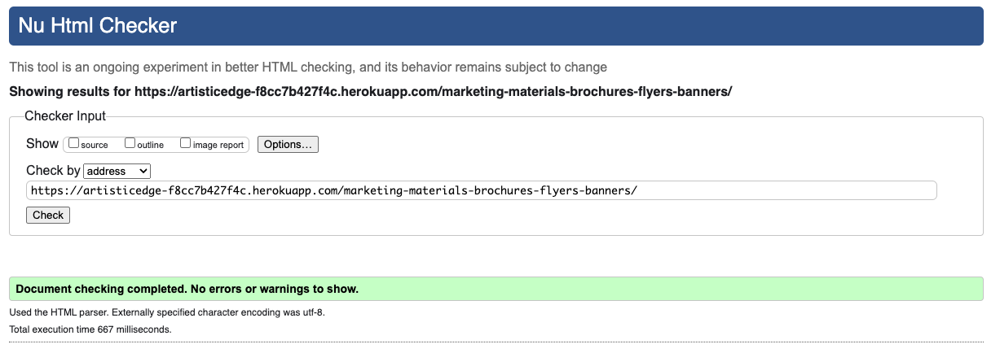

# TESTING

## Manual Testing

Testing was done throughout site development, for each feature before it was merged into the master file.

Usability was tested with the below user acceptance testing, sent to new users to ensure testing from different users, on different devices and browsers to ensure issues were caught and where possible fixed during development.


| Page    | User Actions           | Expected Results | Y/N | Comments    |
|-------------|------------------------|------------------|------|-------------|
| Navigation  |                        |                  |      |             |
| 1           | Click Search button after typing in query | Gives search results | Y |          |
| 2           | Click Sign in link in top banner | Redirection to Sign in page | Y |          |
| 3           | Click Register link in top banner | Redirection to Registration page | Y |          |
| 4           | Click on Logo | Redirection to Home page | Y |          |
| 5           | Click on Shop Link | Opens dropdown that displays Service categories | Y |          |
| 6           | Click on Portfolio | Redirects user Portfolio page | Y |          |
| 7           | Click on Contact | Redirects user to Contact form on home page | Y |          |
| 8           | Click on Basket icon | Opens basket summary page | Y |          |
| 9           | Click on Basket dropdown | Opens basket preview | Y |          |
| User navigation    |                        |                  |      |             |
| 1           | Click on dropdown toggle next to User profile picture | Opens dropdown for user menu | Y |          |
| 2           | Click on Orders in dropdown | Redirection to Orders dashboard | Y |          |
| 3           | Click on Profile in dropdown| Redirection to Profile dashboard | Y |          |
| 4           | Click on Wishlist in dropdown | Redirection to Wishlist dashboard | Y |          |
| 5           | Click on Sign out in dropdown | Redirection to Log out page | Y |          |
| Home        |                        |                  |      |             |
| 1           | Click on View Portfolio button in Hero | Redirection to Portfolio page | Y |          |
| 2           | Click on Service card | Redirection to Service Detail page | Y |          |
| 3           | Enter valid email in contact form | Field will only accept email address format | Y |          |
| 4           | Enter name in contact form | Field will only accept max length of 100 characters | Y |          |
| 5           | Enter message into contact form | Only accepts max length of 500 characters | Y |          |
| 6           | Click on Send button | Shows success message on top of screen | Y |          |
| Footer        |                        |                  |      |             |
| 1           | Click on Branding and Marketing | Redirection to Category page | Y |          |
| 2           | Click on Visual and Graphic Arts | Redirection to Category page | Y |          |
| 3           | Click on Custom Services | Redirection to Category page | Y |          |
| 4           | Click on Digital Design | Redirection to Category page | Y |          |
| 5           | Click on Web Design | Redirection to Portfolio Detail page | Y |          |
| 6           | Click on Marketing Design | Redirection to Portfolio Detail page| Y |          |
| 7           | Click on Graphic Designs | Redirection to Portfolio Detail page | Y |          |
| 8           | Click on Custom Designs | Redirection to Portfolio Detail page | Y |          |
| 9           | Click on  E-Mail Contact | Redirection to Contact Form | Y |          |
| 10           | Click on Visit Facebook | Redirection to Facebook page, new tab | Y |          |
| 11           | Click on Visit LinkedIn | Redirection to LinkedIn page, new tab | Y |          |
| 12           | Click on Privacy Policy | Redirection to Privacy page, new tab | Y |          |
| 13           | Enter valid email in contact form | Field will only accept email address format | Y |          |
| 14           | Click on Subscribe button | Redirection to Thank You page | Y |          |
| 15           | Click on Dietke Steindel | Redirection to Github page, new tab | Y |          |
| 11          | Click on Github icon | Redirection to Github repository, new tab | Y |          |
| 12           | Click on Facebook icon | Redirection to Facebook page, new tab | Y |          |
| 13           | Click on LinkedIn icon | Redirection to LinkedIn page, new tab | Y |          |
| Sign in        |                        |                  |      |             |
| 1            | Type in email | Will only accept registered email | Y |          |
| 2            | Type in name | Will only accept registered password for user | Y |          |
| 3            | Click on sign in button | Shows error, if login details invalid; leads to dashboard after login | Y | |
| 4            | Click on Create account link | Redirection to registration page | Y |  |
| 5            | Click on Reset your password link | Redirection to password reset page | Y | |
| Registration |                        |                  |      |             |
| 1            | Type in Username | Will only accept Username with 4 characters or more | Y |          |
| 2            | Type in E-Mail | Field will only accept email address format | Y |          |
| 3            | Type in passwords | Shows error, if passwords don't match | Y | |
| 4            | Click on Register | Redirection to home page with success message | Y |  |
| 5            | Click on Already have an account? link | Redirection to Log in page | Y | |
| Password Reset |                        |                  |      |             |
| 1            | Type in E-Mail | Field will only accept email address format  | Y |          |
| 2            | Click Send email button | Redirect to password reset success page | Y |          |
| Log out |                        |                  |      |             |
| 1            | Click on Click here to log in again link | Redirect to login page  | Y |          |
| Service Detail |                        |                  |      |             |
| 1            | Hovering over Star rating | Displays tooltip explaining the rating  | Y |          |
| 2            | Click on quantity selector | Allows selection of qty number | Y |          |
| 3            | Click on Add to Basket | Shows success message that item was added to basket | Y | |
| 4            | Click on Add to Wishlist | Shows success message or info message if item is already on wishlist | Y |  |
| Portfolio    |                        |                  |      |             |
| 1            | Click on View Details button | Redirects to Portfolio Detail page | Y |          |
| Portfolio Detail |                        |                  |      |             |
| 1            | Click on Related Services link | Scrolls down to Services of same category | Y |          |
| 2            | Click on Service Card | Redirects to Service Detail page | Y |          |
| Basket Summary |                        |                  |      |             |
| 1            | Click on quantity selector | Allows selection of qty number | Y |          |
| 2            | Click on Update button | Updates basket quanitity for the item | Y |          |
| 3            | Click on Delete button | Removed item from basket | Y | |
| 4            | Click on Add to Wishlist | Shows success message or info message if item is already on wishlist | Y |  |
| 5            | Click on Checkout button | Redirection to Payment page | Y |  |
| Payment Checkout |                        |                  |      |             |
| 1            | Select an existing address | Allows to select saved address that will auto-fill the fields | Y |          |
| 2            | E-Mail field | Is already auto-filled with users email address | Y |          |
| 3            | Select a country | Allows to select a country from prepopulated list | Y | |
| 4            | Type in the Full name | Full name is changed | Y |  |
| 5            | Type in the email | Email is changed | Y | |
| 6            | Type in the phone number | Phone number is changed | Y | Phone number is optional |
| 7            | Type in the address | Address is changed | Y | Second address line is optional |
| 8            | Type in the post code | Post code is changed | Y |  |
| 9            | Type in the city, state | City, State is changed | Y |  |
| 10           | Type payment card data | Payment card data is changed | Y | |
| 11           | Click on Pay for Order button | The pay button will be disabled and the user will see a message to notify them | Y | If the payment card is not valid, the user will see a message to notify them. If the payment was successful, the user will be redirected to the Order place page and user will also receive an email notification |
| 12            | Click on Edit basket button | Redirection to basket summary page | Y | |
| Order Placed |                        |                  |      |             |
| 1            | Click See orders link | Redirection to Order dashboard | Y |          |
| Orders Dashboard |                        |                  |      |             |
| 1            | Click on Order address | Opens dropdown to show order address | Y |          |
| 2            | Click on Item title | Redirection to Service Detail page | Y |          |
| 3            | Click on Contact Us button | Scrolls down to contact form | Y | |
| 4            | Click on Leave Review button | Opens review panel for the item | Y | Only visible if order status is finalized |
| 5            | Select stars for review | Star rating is changed | Y | |
| 6            | Click Submit button for review | Success alert appears | Y | Review panel is automatically closed afterwards |
| 7            | Click Download product button | The attached image opens in a new tab ready for download | Y | Only available once order is finalized and an image is attached from the admin |
| Profile Dashboard |                        |                  |      |             |
| 1            | Email field | Cannot be changed and appears greyed | Y |          |
| 2            | Type in Username | Username is changed | Y |          |
| 3            | Click Remove Image checkmark | Image is not removed yet | Y | This option is only available if user uploaded their profile image |
| 4            | Click Choose file button | Allows user to select a photo file | Y |  |
| 5            | Click save changes button | Is updating the selected changes, User image, name, or removal of image | Y | |
| 6            | Click Subscribe button | Success message appears | Y | User is successfully subscribed to Mailchimp userlist |
| 7            | Click Unsubscribe button | Message appears confirming unsubscribing | Y | The button changes depending on subscription status |
| 8            | Click Delete button | Message appears confirming unsubscribing | Y | The button changes depending on subscription status |
| Address Dashboard |                        |                  |      |             |
| 1            | Click Add Address option | Redirection to Edit/Add Address page | Y | |
| 2            | Click Edit button | Redirection to Edit/Add Address page | Y | Address fields will be pre-filled |
| 3            | Click Set Default button | The address will be marked as default | Y | |
| 4            | Click Set Delete button | The address will be deleted and customer receives success message | Y | |
| Add Address |                        |                  |      |             |
| 1            | Type in Name | Updates Name | Y | |
| 2            | Type in Phone number | Updates phone number | Y | Optional field |
| 3            | Type in Address | Address line us updated | Y | Second line is optional |
| 4            | Type in City, State | City, State is updated | Y | |
| 5            | Type in a Post code | Post code is changed | Y | |
| 6            | Select country | Country is selected | Y | |
| 7            | Click Update address button | Changes will be saved and user will be redirected to Address dashboard where new address is visible | Y | |
| 8            | If user selected Edit Address | The fields will autopopulate and user can change the values | Y | |
| Wishlist Dashboard |                        |                  |      |             |
| 1            | Click on Item title | User will be redirected to Service Detail page | Y | |
| 2            | Click on Remove from wishlist button | Item is removed and user sees a success message | Y |  |
| Admin logged in |                        |                  |      |             |
| 1            | Click on Admin in navigation bar | Redirection to Admin page | Y | The page will be open in a new tab |

---

## Testing User Story

| Casual Website Visitor | Requirement met | How? |
| ------------------------- | --------- | ------------ |
| As a visitor I want to easily navigate the website, view the designer's portfolio, and get a feel for their style without signing up, allowing me to enjoy the content effortlessly. | Y | Portfolio is visible without signing up |
| As a visitor I wish to have the option to subscribe to a newsletter or follow the designer on social media to stay updated on new designs and trends without committing to creating an account. | Y | Newsletter signup and Social in Footer |
| I want to browse and search for graphic designs based on categories (icon, logo, poster). | Y | Search logic implemented |
| I want the option to easily inquire about a design service without committing to a purchase, allowing me to seek more information or discuss customization options with the designer. | Y | Contact Form on Home page |
| I want the option to easily save my preferred design services to a 'cart', allowing me to quickly proceed with the purchase when I decide to sign up. | Y | Session is automatically saved, so they can return to the cart |
| I want the option to easily remove items from my cart or undo accidental additions, ensuring a stress-free experience even if I don't intend to make a purchase. | Y | Delete and Update option implemented |
| I'd appreciate a clear indication that my cart is empty and a seamless way to exit the checkout process without being prompted to create an account. | Y | Cart Icon counter will show if cart is empty |


| Customer and Potential Customers    | Requirement met | How? |
| ------------------------- | ----------- | --------- |
| I expect a clear and user-friendly interface that guides me through the available services, enabling me to easily find and purchase the design service that matches my requirements. | Y | UX implemented: browse categories, items and can purchase them seemlessly via the checkout process |
| I want to view details of a graphic design, including its price and description. | Y | Detailed Service Page is implemented |
| I want to order a graphic design by filling out a form with my requirements. | Y | Order note is implemented |
| I want to see a preview of the quote before making a payment. | Y | Visible in Basket Summary and upon Checkout |
| I want a smooth and secure checkout process, allowing me to review the details of the selected service, customize options if available, and complete the purchase with various payment options. | N | Future development: to pay with various payment methods |
| I want to track the status of my orders (pending, completed). | Y | Order status visible on Dashboard |
| I want to leave a testimonial and rating for the completed designs. | Y | Star Review implemented |
| I expect to receive a confirmation email with detailed information about the purchased service, including estimated delivery times and any additional steps required from my end. | Y | Email is sent for all status updates |
| I want to easily find the 'Sign Up' option, where I can create an account with minimal information, allowing me to save favourite designs and preferences for future reference. | Y | Sign up with email, username and password implemented |
| I'd appreciate a feature that allows me to bookmark or save specific designs or services, so I can seamlessly transition to purchasing when I'm ready. | Y | Wishlist is implemented |
| I'd appreciate a clear pathway to add a service to a 'wishlist' for future reference, even if I'm not immediately ready to make a purchase. | Y | Wishlist is implemented |
| I'd appreciate personalized recommendations based on my saved designs and preferences, enhancing my overall shopping experience and making it more tailored to my interests. | N | Future Development |
| I want a straightforward option to create an account during the checkout process, with the ability to save my information securely for future purchases, minimizing the need for redundant data entry. | Y | Will be asked to sign up when trying to checkout |
| I'd appreciate a clear distinction between the steps required for checkout and optional account creation, ensuring a smooth experience for both one-time and returning customers. | N | Future Development: Guest Checkout |


| Service Provider (Graphic Designer and Shop Owner)    | Requirement met | How? |
| ------------------------- | ---------- | ----------- |
| As a Designer, I want to add new graphic designs to the platform. | Y | Implemented as adding new products |
| I want to view and manage all orders.  | Y | Admin view allows order management |
| I want to upload completed work for customers to download.  | Y | Can upload file and set status to Finalized for an order |
| I want to view and manage user accounts and roles.  | Y | Staff implemented, can manage accounts |
| I want to easily keep track of order, and user communication. | Y | Order Notes and Contact Form implemented |
| I wish to have the option to access billing information through user sign-ups for my bookkeeping and invoice creation. | N | Future Development: Invoice Creation |
| I want to receive timely notifications and details when a customer purchases one of my design services, allowing me to prepare for the project and meet the client's expectations. | Y | Email order notification implemented |
| I wish to have a user-friendly dashboard that provides insights into sales performance, helping me understand which services are popular and allowing me to optimize my offerings. | N | Future Development: Analytics Dashboard |
| I want to provide customer support through accessible channels during the checkout process, such as a contact form, ensuring that customers can get assistance if they encounter any issues. | Y | Contact Form, Socials |
| I wish to receive real-time notifications for successful transactions and, if applicable, be notified of abandoned carts to follow up with potential customers and address any concerns they might have.  | N | Future Development: Abandoned Carts Notification |

---

## Bugs

**Solved bugs:**
1. [#36](https://github.com/DietkeSt/GraphicDesignShop/issues/36) When I visit the product detail page, I should select a number of items for the services I want to order. But it does not show any number with this setup:

```
Qty  {{ num }} 
```

```python
    def product_detail(request, slug):
        product = get_object_or_404(Product, slug=slug, in_stock=True)
        average_rating = round(product.average_rating)
        number_range = range(1, 101)
        return render(request, 'products/detail.html', {
            'product': product,
            'average_rating': average_rating,
            'range': range(5),
            'number_range': number_range,
        })
```

*Solution:*

Removed `,` after `number_range`.

```python
    def product_detail(request, slug): 
        product = get_object_or_404(Product, slug=slug, in_stock=True) 
        average_rating = round(product.average_rating) 
        number_range = range(1, 101) 
        return render(request, 'products/detail.html', { 
            'product': product, 
            'average_rating': average_rating, 
            'range': range(5), 
            'number_range': number_range 
        })
```

2. [#35](https://github.com/DietkeSt/GraphicDesignShop/issues/35) When user navigates to their account profile they should have the option to either sign up or unsubscribe for the newsletter. The user only sees subscribe option, no matter which status he is on.

```


    Newsletter
    You are currently signed up for our Newsletter.
    Unsubscribe from Newsletter


    Newsletter
    Do you wish to subscribe to our Newsletter?
    Subscribe to Newsletter

```

```python
    def check_subscription_status(email):
        email_hash = hashlib.md5(email.lower().encode('utf-8')).hexdigest()
        api_key = settings.MAILCHIMP_API_KEY
        url = f"https://{settings.MAILCHIMP_SERVER_PREFIX}.api.mailchimp.com/3.0/lists/{settings.MAILCHIMP_LIST_ID}/members/{email_hash}"
        user_pass = base64.b64encode(f"anystring:{api_key}".encode()).decode('utf-8')
        headers = {"Authorization": f"Basic {user_pass}"}

        response = requests.get(url, headers=headers)
        if response.status_code == 200:
            data = response.json()
            return data['status'] in ['subscribed', 'pending']
        return False
```

*Solution:*

This was fixed by adding the connection of the check to the edit details view for their profile:

```
    is_subscribed = check_subscription_status(request.user.email)
        return render(request, 'account/user/edit_details.html', {
            'user_form': user_form,
            'is_subscribed': is_subscribed
        })
```


**Unsolved bugs:**

1. When I was adding the Review option I used Javascript and set Alerts instead of sending Messages for successfully leaving reviews. 

As it took me too long to figure out how to change this to messages, I left it as JS Alerts for now.

---

## Validation

### HTML Validation:
- No errors or warnings were found when passing through the official [W3C](https://validator.w3.org/) validator. This checking was done manually by copying the view page source code (Ctrl+U) and pasting it into the validator.

- Home:
    

- Category:
    

- Portfolio:
    

- Portfolio Detail:
    

- Service Detail:
    

- Basket:
    

- Checkout:
    

- Orders Dashboard:
    

- Profile Dashboard:
    

- Address Dashboard:
    

- Add Address:
    

- Wishlist:
    


### CSS Validation:

- [Full CSS Validation Report](documentation/validation/css_validation.pdf)

- No errors or warnings were found when passing through the official [W3C (Jigsaw)](https://jigsaw.w3.org/css-validator/#validate_by_uri) validator except for the warnings about the use of bootstrap and jquery. However, css code works perfectly on various devices.

### JS Validation:

- [Full JS Validation Report](documentation/validation/js_validation.png)

- No errors or warning messages were found when passing through the official [JSHint](https://www.jshint.com/) validator. However, to validate js full the following was added to the top of the file:

    ```
    /* jshint esversion: 6 */
    /* exported getCookie, displayFileName, submitForm */
    /* globals $: true, Stripe: true, STRIPE_PUBLISHABLE_KEY: true, CSRF_TOKEN: true */
    ``` 

### Python Validation:

- No errors were found when the code was passed through the [CI Python Linter](https://pep8ci.herokuapp.com/#), except for the URLs in Newsletter. Did not fix the URL length due to time constraints.

    Otherwise, the code is [Pep 8-compliant](https://legacy.python.org/dev/peps/pep-0008/). 
    
    This checking was done manually by copying python code and pasting it into the validator.

- [Account. Validation Report](documentation/validation/pep8_account.pdf)

- [artistic_edge. Validation Report](documentation/validation/pep8_artistic_edge.pdf)

- [Newsletter. Validation Report](documentation/validation/pep8_newsletter.pdf)

- [Orders. Validation Report](documentation/validation/pep8_orders.pdf)

- [Payment. Validation Report](documentation/validation/pep8_payment.pdf)

- [Store. Validation Report](documentation/validation/pep8_store.pdf)

- [Basket. Validation Report](documentation/validation/pep8_basket.pdf)


---
## Lighthouse Report

LightHouse is a web performance testing tool that can be used to evaluate the performance of a website. The report is generated by Google Chrome.

[Lighthouse Report](documentation/testing/lighthouse_report.pdf)

---

## Compatibility

Testing was conducted on the following browsers;

- Safari:
    - [Compatibility Test Safari Browser](https://youtu.be/JZDv-2ORr9k)

- Chrome:
    - [Compatibility Test Chrome Browser](https://youtu.be/L3Z7XuqGIdU)

- Firefox:
    - [Compatibility Test Firefox Browser](https://youtu.be/ksjIInl_2vE)


---
## Responsiveness

The responsiveness was checked manually by using devtools (Chrome) throughout the whole development. It was also checked with [Responsive Viewer](https://chrome.google.com/webstore/detail/responsive-viewer/inmopeiepgfljkpkidclfgbgbmfcennb/related?hl=en) Chrome extension.

[Responsiveness Report](documentation/testing/responsiveness.pdf)

---

## Project assessment criteria CHECKLIST. Portfolio 5: Project Submission


| Requirement    | Done           |  Comments    |
|-------------|------------------------|------------------|
| at least 3 original custom models with associated functionalities, markedly different from those present in the Boutique Ado walkthrough project if they have been used as a basis for your project.     |          Y              |   23 original custom models + 4 for the future implementations |
| at least one form on the front end, which provides either admin or regular users with CRUD functionality without having to access the admin panel. |           Y            | 4 Full CRUD forms for the user, 8 Full CRUD forms for admin, 2 not full CRUD forms for the user, 3 not full CRUD forms for admin |
| at least one UI element on the front end, which allows either admin or regular users to delete records in the database without having to access the admin panel. |          Y            |    All forms allow customers and personnel to make changes in the DB without accessing the admin dashboard, except for the edit/delete reviews, edit/delete newsletter/promo letter, delete product type, attribute and value. *Note1: stock requests are rendered automatically, when the user sends a request and when the stock is updated by the user*. *Note2: role to the user is rendered ONLY from the admin dashboard as it is matter of the store security.* | 
| evidence of agile methodologies followed during the development of your project in the GitHub repository. |  Y   |                  |
| a robots.txt file. |  Y   |     |
| a sitemap.xml file. |   Y  |     |
| descriptive meta tags in the HTML. |   Y  |     |
| at least one link to an external resource, which makes use of a rel attribute.  |  Y  |     |
| a custom 404 error page. |  Y  |     |
| evidence of either a real Facebook business page, or mockup of one, for the purposes of digital marketing. |  Y  |  Mockup pages for Facebook, Instagram, Twitter |
| evidence of a newsletter signup form for the purposes of digital marketing. |  Y  |     |
| a description of the e-commerce business model including marketing strategies in the README file. | Y  |     |
| DEBUG mode set to False. | Y  |  was created with `EmailMultiAlternatives` for order confirmation, product requested email, product in store email, newsletter and promo email with coupon for loyal customers  |
| working functionality for users to register and log in and out of the application without issues. | Y  |     |
| working E-commerce functionality for users to make purchases within the application. | Y  |     |
| detailed testing write ups, beyond results of validation tools. | Y  |     |